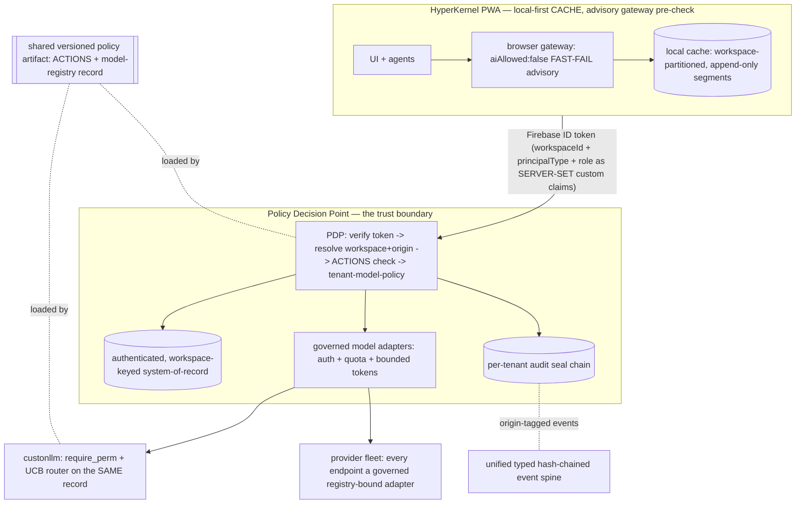
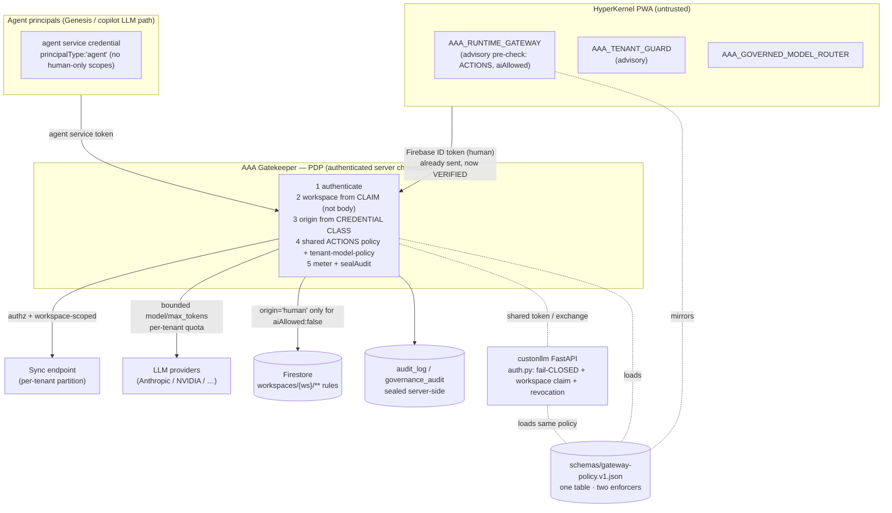
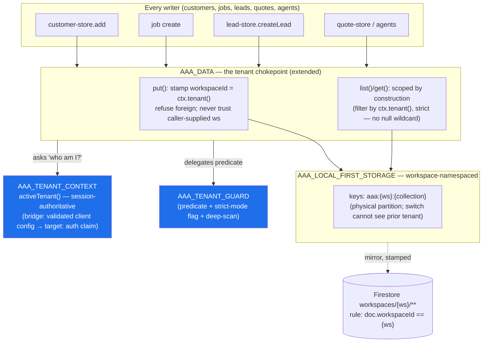
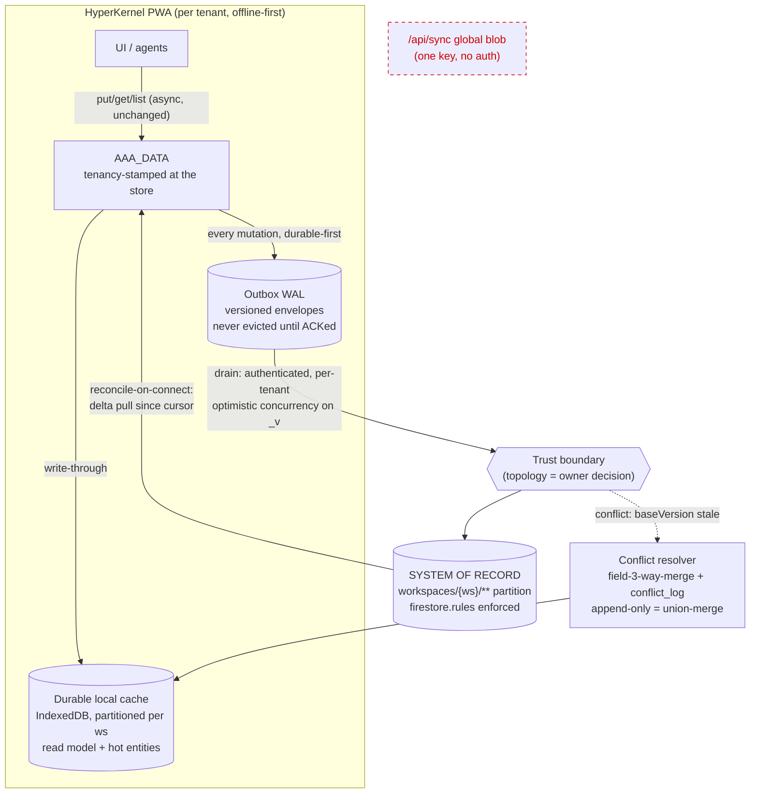
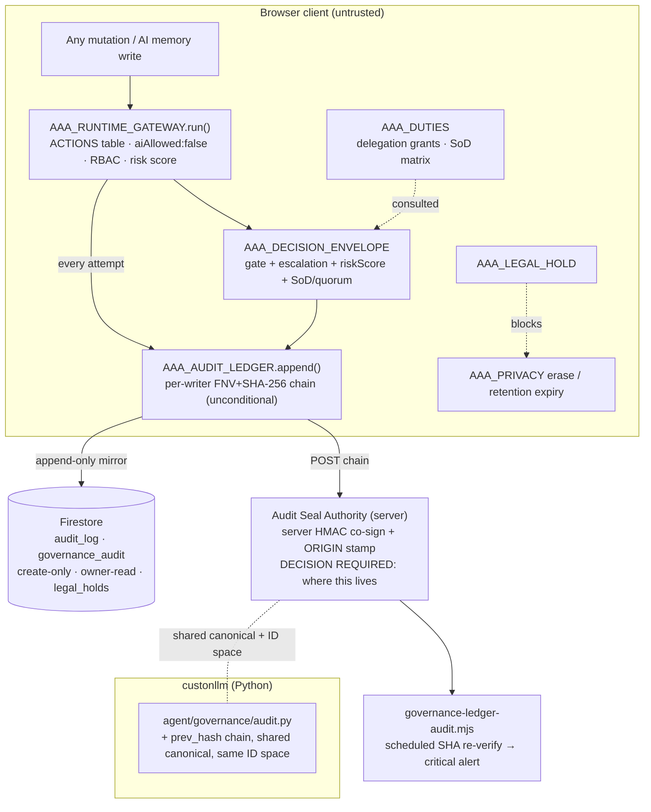
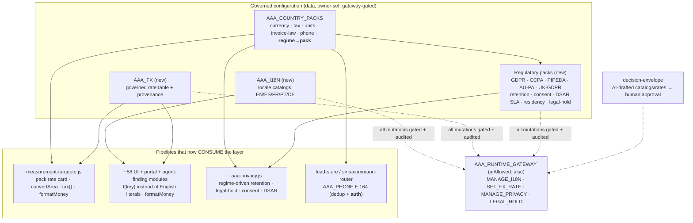
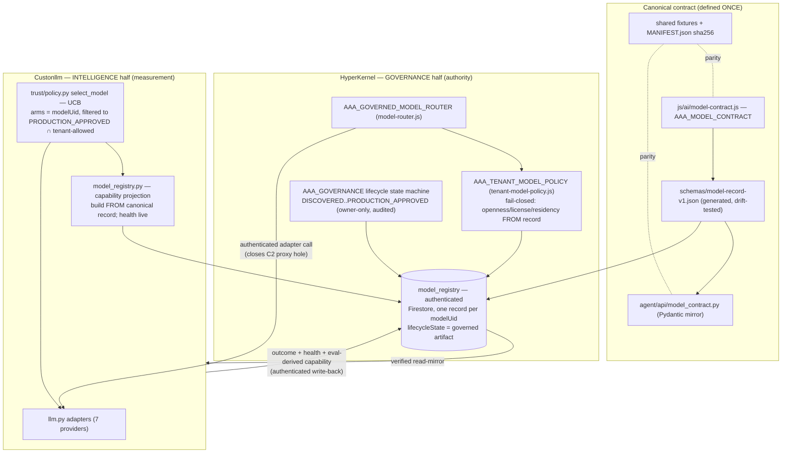

# PROJECT ATLAS — Phase 2: Target Architecture

Future-state blueprint produced 2026-07-19 by an 8-domain design panel, each architect grounded in the fully-reconciled Phase-1 audit (`docs/SYSTEM_AUDIT.md`). Mission + success criteria: `docs/PROJECT_ATLAS_MISSION.md`. Model-fabric inventory: `docs/LEVIATHAN_PHASE0_INVENTORY.md`. **This is design — no code was changed.**

## Executive summary

The audit's verdict was singular: the platform is a deep, governance-rich single-tenant local-first system whose every hard guarantee is enforced in the **browser client or by per-module convention**, not by a server a hostile tenant cannot bypass. The target architecture resolves that with one through-line — **move each existing guarantee to a server boundary, and make tenancy a data-layer invariant** — while reusing the governance vocabulary the audit rated as real and deep (gateway `ACTIONS` with `aiAllowed:false`, decision envelopes, provenance, tenant-model-policy, the audit ledger). Nothing here reinvents governance; it relocates it and hardens its tenancy model.

Five design commitments run through all eight domains:

1. **A Policy Decision Point (PDP) at a server chokepoint** in front of sync and every LLM proxy — closing C1 (open sync blob), C2 (open relay), and the client-asserted half of C3. The single biggest owner decision is *where* the PDP lives (Domain 1); the recommendation is Firebase Auth + Cloud Functions now, behind a shared versioned policy artifact so the PDP can later migrate into a dedicated backend unified with the LEVIATHAN model router — **no contract change required**.
2. **Origin is a property of the authenticated channel, never a payload field** — human sessions vs a structurally distinct agent-credential class — making the browser `aiAllowed:false` an advisory pre-check and the server the enforcer (C4).
3. **Tenancy enforced at the data layer** — `workspaceId` bound into the identity token as a server-set claim and mandatory on every read/write, retiring the ~69 copy-pasted `mine()` filters and closing the null-workspace grandfathering hole (C3).
4. **Cloud as system-of-record, local-first as cache** — ending silent localStorage-quota data loss and per-tenant partitioning the sync store (C5).
5. **Incremental, feature-flagged, reversible** — every step keeps the 4,062 JS + 808 Python assertions green; shadow-mode and dual-write throughout; no big-bang; and — per the reconciliation steer — **no module-refactor budget spent breaking the lazy dependency cycles** (they have an acyclic load-order DAG).

The LEVIATHAN model-fabric seam (Domain 8) rides the same boundary: one canonical model-registry record — openness class, license hash, weight hashes, lifecycle state — defined once and mirrored across repos exactly like the copilot contract, turning the two separate model routers into two halves of one governed gateway. This blueprint therefore also **defines the LEVIATHAN Phase-1 cut.**

## How each critical theme is resolved

| Theme (from the audit) | Resolved by | Mechanism |
|---|---|---|
| **C1** — unauthenticated sync / open global blob | Domain 1 + 3 | PDP-authenticated, workspace-keyed sync endpoint; retire the single global blob; per-tenant partitioning |
| **C2** — unauthenticated LLM proxies / open relay + cost amplification | Domain 1 + 8 | every proxy behind the PDP (auth + workspace-scope + tenant-model-policy + bounded model/max_tokens + per-tenant quota); provider endpoints become governed registry-bound adapters |
| **C3** — client-asserted tenancy | Domain 1 + 2 | `workspaceId` a server-set token claim (identity-bound, not body-asserted) **and** a mandatory, enforced data-layer invariant |
| **C4** — browser-only AI hard-block | Domain 1 + 4 | server-side origin attestation from credential class; agent tokens categorically rejected on `aiAllowed:false` actions; browser gateway becomes the fast-fail advisory pre-check |
| **C5** — localStorage-as-DB with silent quota loss | Domain 3 + 7 | cloud system-of-record, local-first cache; `put()` never returns success on a dropped write; append-only segment store for quota relief |
| **C6** — audit seal single-tenant-sequenced | Domain 4 | per-tenant (per-writer) seal chains; unconditional chaining independent of the optional security module; seal moves server-side of the PDP |
| *High* — 233 unindexed `data().list()` full-scans | Domain 2 + 7 | tenant-scoped indexed/paginated queries; the data-layer invariant makes scoping structural |
| *High* — dormant event spine / 345 hand-ordered globals | Domain 5 | unify untyped `AAA_EVENTS` into the typed hash-chained bus; wire the 100%-dormant taxonomy; real module/dependency system (lazy cycles left intact) |
| *Team-4* — hardcoded USD/en-US, no i18n substrate | Domain 6 | i18n string catalog; currency/tax engine the quote pipeline consumes; regulatory abstraction layer + GDPR/CCPA/PIPEDA/AU/UK packs |
| *Team-2* — ungoverned AI-writable surface, no legal hold, flat RBAC | Domain 4 | shrink the 221 ungoverned `put` sites behind gateway ACTIONs; legal-hold primitive; delegation chains + segregation of duties; risk scoring |
| *LEVIATHAN* — separate routers, no openness/license/integrity spine | Domain 8 | one canonical model record (O1–O5 + license hash + weight hashes + lifecycle) mirrored across repos; one governed gateway; 'no lab indispensable' as a CI+runtime guard |

## Consolidated Decisions Required

The design surfaces **32 owner-level decisions** rather than assuming them; the full set is embedded per domain below. The load-bearing ones — the choices that gate Phase 3 (the roadmap) — are:

| # | Decision | Recommendation |
|---|---|---|
| 1 | Where the authoritative Policy Decision Point (PDP) lives — the deployment/trust-boundary topology for the server chokepoint in front of sync + every LLM proxy. | Option A now, with a contract seam to Option B later |
| 2 | Physical storage substrate for tenant partitioning | (a) now as the reversible bridge that closes L4-6, sequenced toward (b) as the durability track that also resolves C5 |
| 3 | Trust-boundary topology for the authoritative per-tenant write/drain path (the load-bearing owner decision; shared with Domain 1/2's server-boundary move) | (a) — it reuses the ONE real boundary already in the repo (firestore.rules is already per-tenant and rated 'genuinely good') and the already-partitioned workspaces/{ws} tree that aaa-firebase.js writes, minimizing new su |
| 4 | Where the Audit Seal Authority (server HMAC co-sign + server-observed origin stamp) runs — this is the trust-boundary topology choice for Domain 4 and gates Moves 2 and 5. | (a) Firebase Cloud Functions + Firestore rules for Phase 2 |
| 5 | Module-system topology (the trust-boundary-equivalent choice for the client build) | A now |
| 6 | FX rate source and its trust boundary | (a) now, (b) once the authenticated server boundary from the security domains exists |
| 7 | Where the paginated, tenant-scoped query actually executes (couples to the deployment/trust-boundary topology decision owned by the security domain) | Ship the AAA_DATA.query() SEAM now backed by the client-side secondary index (option a) so all 233 call sites migrate once and the suites stay green offline; dual-back it with (b) once the topology domain picks the bound |
| 8 | Registry system-of-record and write-arbitration boundary (rides the Domain-1 trust-boundary decision; this IS the LEVIATHAN Phase-1 cut). | (A) HyperKernel-authoritative via authenticated Firestore + a single Cloud Function write-gate |

**The keystone decision is #1 — where the PDP lives** (Firebase Auth + Cloud Functions vs a dedicated backend vs authenticated Netlify functions). Every other domain projects onto it. The panel's recommendation: Firebase Auth + Cloud Functions **now** (it verifies a token the client already sends), behind a shared versioned policy artifact so the PDP can migrate into a dedicated backend later with no contract change. The remaining ~24 decisions are domain-internal and listed in their sections.

## Target system map



---

## Domain 1 — Server Trust Boundary & Origin-Aware Enforcement (the keystone)

### The finding this domain closes

Every hard guarantee in the platform — the AI hard-block (`aiAllowed:false`), the tenant boundary, and (for the proxies) cost/abuse control — is enforced **in the browser client or by per-module convention**. A hostile or replaced client, or a direct API call, bypasses all of it. Concretely, today:

- **C1** `/api/sync` (`netlify/functions/sync.mjs`) authenticates nobody and stores every device's jobs/customers/mutations under one global blob key `state`; an unauthenticated `GET` returns the whole PII dataset.
- **C2** `netlify/functions/claude.mjs` (and `nemotron/vision/private-gpu/…`) run with `access-control-allow-origin:'*'`, no caller check, and pass caller-chosen `model`/`max_tokens` straight through (`claude.mjs:41`) — an open relay on the owner's paid keys with a cost-amplification vector on top.
- **C4** the gateway's `aiAllowed:false` (`aaa-runtime-gateway.js:154-158`) is a **browser** guarantee. `firestore.rules` authorizes on workspace membership + role (`firestore.rules:171-177`) and has **no concept of `origin:'ai'`** — an AI agent and a human present the same member credential, so no server can tell an AI-origin write from a human one.
- **C3 (half)** workspace identity is client-asserted end to end: `AAA_CONFIG.workspaceId` (`aaa-config.js`) drives `tenant-guard.js:25`, the proxy body ships `workspace_id: cfg().workspaceId` (`aaa-firebase.js:115`), and custonllm's token (`agent/api/auth.py`) carries `{name, role, exp}` with **no workspace claim** — `copilot.py:106` only checks that the client's two self-declared workspace ids match each other.

The governance **vocabulary** to fix this already exists and is deep. The job is to **move the existing guarantees to a server boundary a tenant cannot cross** and make workspace an **identity-derived** value, not a request field — not to reinvent governance.

### The keystone: one authenticated Policy Decision Point (PDP)

Introduce a single server-side chokepoint — the **AAA Gatekeeper (PDP)** — that sits in front of **(a)** sync and **(b)** every LLM proxy, and re-runs the same policy the browser gateway runs today. It is the server twin of `AAA_RUNTIME_GATEWAY`, not a new governance model.

The PDP does exactly five things on every request, all server-authoritative:

1. **Authenticate** the caller (verify the token — the client already sends one; see §Identity).
2. **Resolve tenancy from identity** — read `workspaceId` from the caller's verified claim / membership doc, **never** from the request body. A body `workspace_id` that disagrees is a `TENANT_BOUNDARY` refusal (this is `tenant-guard.js`'s `guardContext` logic promoted to the server, where it can't be edited away).
3. **Derive origin from the credential class** (§Origin) — not from a payload field.
4. **Apply the shared ACTIONS policy** — the exact `aiAllowed` + `permission` table lifted out of `aaa-runtime-gateway.js` (§Projection), plus the server copy of `tenant-model-policy.js` for model calls.
5. **Meter + seal** — per-tenant quota/cost accounting for proxy calls, and the audit seal (`aaa-security.sealAudit`) computed **server-side of the PDP** so the chain no longer depends on the honest client (this also lets C6's seal become per-writer/per-tenant instead of one client-wide sequence).

Only after all five pass does the PDP relay to the provider (LLM) or commit to the store (sync).

### Identity & session model — workspace bound to identity, not asserted

The substrate already exists and is half-wired: `aaa-firebase.js` signs users in via Firebase Auth (`signIn`/`signUp`, `_storeSession`) and **already attaches the ID token** on proxy calls (`authHeaders()` at `callProxy`, `aaa-firebase.js:115`). The server simply never verifies it. So the highest-leverage move is to **verify a token that is already flowing**.

- **Human principals** authenticate with an interactive Firebase Auth user session. At sign-in the server stamps **custom claims** `{ workspaceId, role, principalType:'human' }` from the authoritative `workspaces/{ws}/members/{uid}` doc — the same doc `firestore.rules:13-21` already trusts. `workspaceId` now lives in a signed claim the client cannot forge, retiring the client-asserted `workspace_id` field on both the proxy body and the copilot envelope.
- **Agent principals** (Genesis agents, the copilot's LLM enrichment path, any autonomous caller) authenticate with a **distinct agent service credential** whose claim set carries `principalType:'agent'` and a scope set that, by construction, **excludes every `aiAllowed:false` action**.
- **Sessions/step-up/revocation**: short-lived ID tokens (~1h) as the wire credential, backed by a small server-side session record for step-up state (the existing `aaa-security.js` session + `gateCheck` step-up machinery moves behind the PDP, so `STEP_UP_REQUIRED` is enforced where the client can't skip it) and an immediate-kill revocation list. This directly fixes the custonllm high-severity gaps: **fail-closed** when the key is unset (today `auth.py:103` returns `role=owner` — fail open), a **workspace claim**, and a **revocation store** (today a leaked HMAC token is valid for its full TTL).

### Origin-aware enforcement — the AI-block backstop (C4)

This is the part `firestore.rules` structurally cannot express. The fix is to make **origin a property of the authenticated channel, not a payload assertion**:

- The PDP maps **token class → origin**: a human-principal token ⇒ `origin:'human'`; an agent-service token ⇒ `origin:'ai'`. The client-supplied `origin` field (`aaa-runtime-gateway.js` `run({origin})`) becomes an advisory hint for UX only; the server ignores it.
- `aiAllowed:false` becomes a server rule: **"this action requires a human-principal token; agent-class tokens are categorically rejected,"** audited on denial exactly as the browser gateway audits `AI_NOT_PERMITTED` today.
- The browser `aaa-runtime-gateway.js` stays in place as the **fast-fail advisory pre-check** (good UX, no round-trip), but it is no longer the enforcement point. A replaced client, a compromised member credential, or a raw REST call cannot manufacture a human origin, because it cannot mint a human-principal token — that requires interactive Firebase Auth.

Human authority is thereby **strengthened, never weakened**: the `aiAllowed:false` constant, owner-approval, audit, and reversibility rules are unchanged; they simply gain a boundary no tenant can bypass.

### Projecting the existing gateway ACTIONS + tenant-model-policy onto the boundary

No new policy language. Extract the `ACTIONS` table (`aaa-runtime-gateway.js:40-128`) into a **versioned policy artifact** `schemas/gateway-policy.v1.json`, mirrored to the browser global and to a Python loader **exactly as the copilot contract v1 is mirrored** (`agent/api/copilot_contracts.py` ↔ the HyperKernel schema). A CI conformance test fails if the in-code table and the artifact diverge in either repo — the same discipline the LEVIATHAN inventory recommends for the model registry.

- The **PDP loads the same artifact** and enforces `aiAllowed` + `permission` server-side. One table, two enforcers (browser advisory, server authoritative), zero drift.
- **Model calls** additionally pass through the server copy of `tenant-model-policy.js` (`pick()` / `marketAllowed()`), so the fail-closed per-tenant allowlist + residency + restricted-market checks — today consulted **before dispatch in the client** — run where a hostile tenant cannot skip them. The `RUN_MODEL` gateway action and the governed `model-router.js` path (registry-resolve → gate → active+enabled → adapter → provenance) are preserved; the router's server-proxy adapters now terminate at the authenticated PDP instead of the open `claude.mjs`.
- The **audit seal** (`aaa-security.sealAudit`, `aaa-runtime-gateway._audit`) is computed server-side of the PDP, removing the client from the tamper-evidence path and giving C6's single-tenant seal sequence a natural server home to become per-writer/per-tenant.

### The two chokepoints, concretely

- **Sync**: replace the single-blob `sync.mjs` with an authenticated, **workspace-keyed** endpoint that derives `workspaceId` from the verified claim and reads/writes only that tenant's partition. An unauthenticated request gets `401`; a cross-tenant request gets `TENANT_BOUNDARY`. (Promoting the store from best-effort blob to durable system-of-record is **Domain 2 / durability**; this domain only makes the endpoint authenticated and tenant-scoped.)
- **LLM proxies**: `claude.mjs`, `nemotron.mjs`, `vision.mjs`, `private-gpu.mjs`, `research.mjs`, `receipt-ocr.mjs`, `transcribe.mjs` all move behind the PDP: authenticate → resolve workspace+origin → tenant-model-policy → `RUN_MODEL` → **bound `model`/`max_tokens`** (kills the cost-amplification vector) → **per-tenant quota/metering** → relay. `CORS '*'` is replaced by an allowlist. The duplicate Firebase-functions proxy stack collapses into the same PDP, ending the two-stack drift.

### Target-state diagram



### What stays client-side vs server-authoritative

| Guarantee | Today (enforcement) | Target (enforcement) |
|---|---|---|
| `aiAllowed:false` | browser `aaa-runtime-gateway.js` | **PDP** via credential-class origin; browser = advisory pre-check |
| Tenant boundary | client `AAA_CONFIG.workspaceId` + `mine()` | **PDP** from verified claim; body `workspace_id` rejected on mismatch |
| Proxy access / cost | none (`CORS '*'`) | **PDP** auth + bounded params + per-tenant quota |
| Sync access | none (open blob) | **PDP** auth + workspace-scoped partition |
| Audit seal | client, if security module loaded | **PDP** server-side seal (enables per-tenant sequence, C6) |
| Model policy | client `tenant-model-policy.js` | **PDP** server copy, fail-closed |

### Why this is safe to build

It reuses the only real server boundary that exists (`firestore.rules` membership), verifies a token the client already sends, and keeps every human-authority constant intact — it just relocates each to a place a tenant cannot reach. The migration is flag-gated and shadow-first (see sequencing), so the live, green platform stays green at every step, and the shared policy artifact means the PDP can later consolidate into a dedicated backend (aligned with the LEVIATHAN model-router unification) without a contract change.

### Decisions this domain surfaces

- **Where the authoritative Policy Decision Point (PDP) lives — the deployment/trust-boundary topology for the server chokepoint in front of sync + every LLM proxy.**
  - *Options:* A) Firebase Auth + Cloud Functions: reuse the one real server boundary that already exists (firestore.rules membership model) as the identity substrate; make callable/HTTPS Cloud Functions the PDP; workspace + principalType arrive as verified custom claims, never request body; retire the sync blob and fold proxies behind the function. Pro: smallest trust-model delta (Firebase Auth ID tokens ALREADY flow from aaa-firebase.js:115 — the server just has to verify them), custom claims give server-authoritative workspace+origin for free, Firestore rules already partition tenants. Con: Firebase/GCP coupling, cold starts, requires Blaze, leaves custonllm's separate auth to reconcile. B) Dedicated backend: promote custonllm's FastAPI into the ecosystem PDP so ONE service enforces the gateway policy for both repos and unifies with the LEVIATHAN model router. Pro: single policy brain across repos, real revocation/session store, proper horizontal-scale story, natural home for per-tenant metering. Con: largest lift; custonllm is single-instance/fail-open today (auth.py:103) and must grow tenancy + an auth store FIRST; adds a network hop to every human mutation. C) Authenticated Netlify functions: add JWT-verify + workspace-resolution middleware to the existing netlify/functions/*. Pro: smallest deploy change, proxies already live there. Con: stateless (needs an external session/revocation store anyway), does nothing for custonllm, and the Netlify+Firebase proxy-stack duplication keeps drifting.
  - *Recommendation:* Option A now, with a contract seam to Option B later. Adopt Firebase Auth + custom claims (workspaceId, principalType, role) as the identity substrate immediately — it is the only change that verifies a token the client is ALREADY sending — and put the PDP in Cloud Functions in front of sync + all proxies, sharing ONE versioned policy artifact (the extracted ACTIONS table) that custonllm's require_perm also loads. This closes C1/C2/C4 and half of C3 on the existing boundary with minimal new surface, while the shared policy contract means the PDP can migrate into a dedicated backend (Option B, aligned with LEVIATHAN model-router unification) with no contract change. Do NOT pick Option C: it hard-codes the two-stack drift the audit already flagged and solves neither custonllm nor durable revocation.
- **How server-side ORIGIN (AI vs human) is attested — the backstop Firestore rules cannot express today (C4).**
  - *Options:* A) Credential-class / auth-channel-derived origin: humans authenticate with an interactive Firebase Auth user session; agents authenticate with a STRUCTURALLY DISTINCT agent service credential that can never hold human-only scopes. The PDP derives origin from WHICH credential signed the request, never from a client-supplied origin:'ai' field. aiAllowed:false becomes 'requires a human-principal token; agent tokens are categorically rejected.' B) Signed origin assertion: keep one credential, have the client sign an origin claim. C) Trust the client's origin field (status quo).
  - *Recommendation:* Option A. Origin must be a property of the authenticated channel, not an assertion inside the payload — that is the whole point of a backstop against a replaced/compromised client or a direct API call. Agent principals get their own credential class with a scope set that excludes every aiAllowed:false action by construction; the PDP maps token-class → origin. Option B still lets a hostile client mint origin:'human'; Option C is exactly the C4 gap. This makes the browser gateway's aiAllowed:false (aaa-runtime-gateway.js:154-158) an advisory pre-check and the server the enforcer, without weakening the constant.
- **Token TTL, workspace binding, and revocation model for the session layer (fixes the client-asserted workspace in C3 and the custonllm no-revocation / fail-open gaps).**
  - *Options:* A) Short-lived Firebase ID tokens (~1h) carrying workspaceId + principalType + role as CUSTOM CLAIMS set server-side from the membership doc; revocation via Firebase token-revoke + claim change; custonllm verifies the same token or a server-minted exchange token. B) Long-lived client-minted HMAC tokens (custonllm status quo, auth.py) — revocable only by rotating the master key, and fail-open when the key is unset. C) Opaque server-session ids against a session store in the PDP.
  - *Recommendation:* Option A as the wire credential, backed by (C) a small server-side session/revocation record for step-up state and immediate kill. Workspace is written into the token as a custom claim by the server at sign-in from workspaces/{ws}/members/{uid} — so the client can no longer assert workspace_id (the callProxy body field at aaa-firebase.js:115 and copilot.py:106 become server-verified, not client-trusted). Custonllm must (a) stop failing open when API_AUTH_KEY is unset (auth.py:103 — fail CLOSED), (b) add a workspace claim, and (c) gain a revocation list. This resolves the second half of C3 and the high-severity custonllm revocation/fail-open findings.

### Migration sequencing (incremental, flagged, reversible)

Incremental, feature-flagged, dual-write; every step keeps the 4062 JS + 808 py suites green. STEP 0 (contract extraction, zero behavior change): lift the ACTIONS table out of aaa-runtime-gateway.js into a versioned policy artifact schemas/gateway-policy.v1.json, mirrored to the browser global and to a Python loader exactly like the copilot contract; add a conformance test that the in-code table equals the artifact in BOTH repos. STEP 1 (verify-only shadow): stand up the PDP (Cloud Function) that verifies the Firebase ID token the client ALREADY sends (aaa-firebase.js:115), resolves workspace+principalType from the membership doc into custom claims, and re-runs the ACTIONS check — but in shadow mode it only LOGS mismatches vs the client verdict; nothing is blocked. Ship the agent service-credential class alongside, unused. STEP 2 (proxy enforcement behind a flag): route claude.mjs/nemotron/vision/etc. through the PDP; enforce auth + workspace-scope + tenant-model-policy (server copy) + RUN_MODEL + bounded model/max_tokens + per-tenant quota. Flag PROXY_REQUIRE_AUTH defaults off, flip per-tenant, then globally; the open CORS '*' relay dies when the flag is on. STEP 3 (sync dual-write): introduce an authenticated, workspace-keyed sync endpoint; client dual-writes to old blob + new endpoint; compare; then cut reads over and decommission the global blob key. STEP 4 (origin backstop hard-on): flip the PDP from shadow to ENFORCING — agent-class tokens are categorically rejected on aiAllowed:false actions server-side; client gateway stays as the fast-fail advisory pre-check. STEP 5 (custonllm reconciliation): fail-closed when API_AUTH_KEY unset (auth.py:103), add workspace claim + revocation list, verify the shared token/exchange, load the same policy artifact. Each step is independently revertible by its flag; no big-bang, no module-refactor budget spent on the lazy dependency cycles (per the reconciliation steer).

---

## Domain 2 — Tenancy as a Data-Layer Invariant

### Problem, stated precisely (from the audit)

Tenancy today is a *habit*, not an *invariant*. Three OBSERVED facts define the gap:

1. **The unified data layer is tenant-blind.** `AAA_DATA.list/get/put` (`js/core/aaa-data.js:31-41`) are thin pass-throughs over `AAA_LOCAL_FIRST_STORAGE` with zero workspace logic. Isolation is reconstituted downstream by a filter — `function mine(r) { return r && (r.workspaceId == null || r.workspaceId === ws()); }` — **copy-pasted into ~69 modules** (e.g. `js/quotes/quote-store.js:58`, `js/measurements/field-capture-session.js:30`). One forgotten filter is a silent cross-tenant read, and ~40 modules (including `js/governance/audit-ledger.js:150`) list collections with no filter at all.

2. **The `null` clause is a wildcard.** `workspaceId == null` passes for *every* tenant — in both the copy-pasted `mine()` and the canonical `AAA_TENANT_GUARD.checkRecord` (`js/core/tenant-guard.js:47-51`). It exists to grandfather legacy records, but it means any untagged record is visible to all workspaces.

3. **Core PII entities are never stamped, and the physical store is one shared blob.** `customer-store.add()` (`js/customers/customer-store.js:44-61`) writes straight to `AAA_LOCAL_FIRST_STORAGE` with no `workspaceId`; job creation does the same (`js/ui/new-job-flow-ui.js:66`); `lead-store.createLead()` builds the lead object (`js/leads/lead-store.js:135-155`) with no `workspaceId`. `AAA_LOCAL_FIRST_STORAGE` keys collections as a flat `aaa:<collection>` namespace (`js/core/local-first-storage.js:17,82`) with zero workspace partitioning. **Net effect (CONFIRMED):** switch `workspaceId` on a shared device and every prior tenant's customers, jobs, and leads pass `mine()` and render.

Note what already works and must be preserved: `quote-store.js` and `field-capture-session.js` *do* stamp `workspaceId: ws()` on write; cloud docs are path-scoped at `workspaces/{workspaceId}/{collection}/{clientId}` (`js/core/aaa-firebase.js:79`); Firestore rules enforce per-workspace membership server-side (`firestore.rules:137-184`) — "the strongest tenancy asset in the system." The design **moves the guarantee those two stampers already honor into the data layer itself**, so it holds by construction rather than by discipline.

### Design principle

> **Tenancy is stamped on write and scoped on read, once, at the `AAA_DATA` chokepoint — and physically partitioned beneath it — so no module can express a cross-tenant read or an unstamped write.** `mine()` stops being a thing every module remembers and becomes a thing the store guarantees.

We extend the existing governance vocabulary rather than inventing: `AAA_TENANT_GUARD` already owns the tenant predicate and the deep-scan refusal (`guardContext`). We promote it from an advisory library (fan-in 3) to the **enforcement authority the data layer calls on every operation**.

### Target-state architecture



Four cooperating pieces, three of which extend existing modules:

**1. `AAA_TENANT_CONTEXT.activeTenant()` — one authoritative source (new, tiny).** A single accessor for "which workspace is this session allowed to touch," replacing the ~72 scattered `cfg().workspaceId || 'default'` reads. During migration it wraps `AAA_CONFIG.workspaceId` (unchanged behavior). Its *target* source is the authenticated identity (Firebase custom claim / session), so the tenant is server-derived, not client-asserted — this is the C3 seam (see Decision 2). Centralizing the read now means the later swap is one file.

**2. `AAA_DATA` becomes the enforced chokepoint (extend `js/core/aaa-data.js`).**
- `put(collection, id, value)` **stamps** `workspaceId = ctx.activeTenant()` onto the record. A caller-supplied `workspaceId` that differs is **refused** (`TENANT_BOUNDARY`), never written — the store, not the caller, is the source of the stamp. This makes stamping *mandatory and central*: customers/jobs/leads become stamped the moment they route through `put()` (Phase 3), with no per-module field-adding.
- `list(collection)` / `get(collection, id)` are **scoped by construction**: they return only records for `activeTenant()`, delegating the predicate to `AAA_TENANT_GUARD.mine`. This single change tenant-scopes the ~40 unfiltered listers (audit-ledger, scorecards, prompt-registry, the revenue engines) for free.

**3. `AAA_TENANT_GUARD` gains a strict mode (extend `js/core/tenant-guard.js`).** Add `mine(rec)` as the *one* canonical predicate and a `strict` flag:
- `strict:false` (migration): `workspaceId == null || === ws()` — today's grandfather behavior, byte-identical, so suites stay green.
- `strict:true` (post-backfill): `workspaceId === ws()` — **null no longer passes.** An unstamped record is refused/quarantined, not shown to everyone. This is the hole-closing flip, gated by the `tenantStrict` flag.

**4. Physical partitioning in `AAA_LOCAL_FIRST_STORAGE` (extend `js/core/local-first-storage.js`).** Namespace collection keys as `aaa:{ws}:{collection}`. Now a workspace switch *physically* addresses a different blob — even a straggler that writes directly to storage cannot read the prior tenant's data. This is belt-and-suspenders under the logical stamp and directly closes L4-6. (See Decision 1 for the storage-substrate choice.)

### Closing the null-grandfather hole (the migration)

The grandfather clause cannot simply be deleted — existing untagged customers/jobs/leads would vanish from the one live tenant. The closure is a **backfill-then-flip**, and it is uniquely safe to do now precisely *because the platform is single-tenant today*: there is exactly one real `workspaceId` per store, so `null → activeTenant()` is unambiguous (no adjudication needed — the ambiguity only exists at future multi-tenant import time, handled by Decision 3).

- **`AAA_TENANT_MIGRATION.run()`** (new, idempotent, governed): iterate every collection; for each record with `workspaceId == null`, stamp `activeTenant()`. Additive and reversible (rollback = clear the stamp + re-enable `strict:false`). It writes a **migration receipt through the governed path** — `RUN_MIGRATION` gateway ACTION (`aiAllowed:false`, human-only) into the audit ledger — recording collection, count, and pre/post checksums, so the backfill is itself auditable and replayable. No record is deleted; nothing crosses a tenant.
- **Verification gate:** a shadow pass counts `null`-workspace records remaining per collection; the `tenantStrict` flip is blocked until that count is zero and the receipt is sealed.

### Keeping `mine()` working, then retiring it (dual-guard)

- **Dual-guard window:** the 69 local `function mine` definitions are first **replaced by a one-line delegation** to `AAA_TENANT_GUARD.mine` (pure refactor — identical grandfather semantics, suites green). Simultaneously `AAA_DATA.list()` filters by the *same* predicate. Every read is now guarded in *two* places with one shared definition — belt and suspenders during backfill.
- **Retirement:** once `list()/get()` are tenant-scoped by construction and `tenantStrict` is on, the per-call-site `.filter(mine)` is redundant. Retire it collection by collection (each removal is a no-op the suite proves), until the only `mine` left is the one inside `AAA_TENANT_GUARD`. A lint/test guard (`no local mine() redefinition`; `no data().list without going through the scoped facade`) prevents regrowth — the pattern that let 69 copies accrete is what we remove.

### Firestore-rules alignment

Cloud docs already live under `workspaces/{ws}/**` and membership is enforced (`firestore.rules:137-184`) — but **the document body's `workspaceId` is never checked against its path.** A tampered client could write a doc under its own `{ws}` whose body claims another workspace; since the JS layer filters on `body.workspaceId`, a poisoned field could misroute or hide a record. Alignment closes the logical/physical seam:

- **Path/body agreement:** on create and update under `workspaces/{ws}/{collection}/{doc}`, require `request.resource.data.workspaceId == ws` whenever the field is present. The stamp the data layer writes must equal the path the rules enforce — the two tenancy signals can no longer disagree.
- **Presence requirement (post-backfill):** once core collections are backfilled and mirrored with the field, require `workspaceId` present on create for `customers`, `jobs`, `leads`, `quotes`. Sequenced *after* the client stamps (Phase 3) so a rule deploy never rejects an in-flight write.
- This is additive to the existing `isSpecialCollection` / financial / legal / comms guards — it composes into the same `match /{collection}/{docId}` block, and the append-only audit/governance blocks are untouched. Audit-ledger's per-writer chain (`writerId` lanes, `audit-ledger.js:150-169`) still holds *within* a tenant; scoping its `list()` merely stops cross-tenant entries from intermixing at read time. (The single-tenant *seal sequence* concern is C6's downgraded item, out of this domain.)

### Why this resolves C3 and stays within human authority

- **C3 (client-asserted tenancy):** tenancy stops being a per-module convention and becomes a data-layer invariant — stamped on write, scoped on read, physically partitioned, and rule-validated end to end. Combined with Decision 2 (server-derived `activeTenant`), the client can no longer *assert* a tenant it isn't a member of.
- **Human authority preserved and extended:** the migration and any future null-adjudication run through the gateway as `aiAllowed:false` human-only ACTIONS with sealed receipts. No AI path can stamp, re-tenant, or merge records. The change only *tightens* what a record can do — it removes the cross-tenant wildcard; it grants nothing new.

### Decisions this domain surfaces

- **Physical storage substrate for tenant partitioning**
  - *Options:* (a) Namespace keys in the existing localStorage KV as aaa:{ws}:{collection} — minimal change, closes the workspace-switch leak now; (b) Migrate to IndexedDB with a per-workspace object store — larger capacity (addresses C5 quota loss) and cleaner partitioning, but a bigger migration; (c) Logical stamp only, no physical partition — smallest change, but a direct-to-storage straggler could still read another tenant's blob.
  - *Recommendation:* (a) now as the reversible bridge that closes L4-6, sequenced toward (b) as the durability track that also resolves C5. Avoid (c): it leaves the physical switch-leak open and relies on every future writer being disciplined — the exact failure mode we are removing.
- **Authoritative source of activeTenant() (the C3 root)**
  - *Options:* (a) Keep AAA_CONFIG.workspaceId as the source but treat it as a hint that Firestore membership + the new path/body rule validate server-side; (b) Derive activeTenant() from the authenticated session (Firebase custom claim / signed session), so the browser cannot assert a workspace it is not a member of — requires the Domain-1 authenticated server boundary. This is the deployment/trust-boundary topology choice the mission reserves for the owner (authenticated Firestore+Functions vs dedicated backend vs authenticated Netlify functions).
  - *Recommendation:* (b) as the target — it is what actually closes C3 — reached via (a) as the bridge that ships value immediately. Centralizing the read in AAA_TENANT_CONTEXT now makes the later swap a one-file change. Recommend authenticated Firestore rules + Cloud Functions as the lowest-lift topology, since the strongest existing asset (firestore.rules) already lives there; surface the dedicated-backend option for the multi-cloud, residency-partitioned end state.
- **Handling of un-attributable legacy/imported null-workspace records at the strict flip**
  - *Options:* (a) Stamp all null -> the sole current tenant (safe and unambiguous while the platform is single-tenant today); (b) Quarantine null records into a holding collection requiring owner adjudication before they re-enter any tenant view.
  - *Recommendation:* (a) for the one-time backfill of today's single live tenant (there is exactly one correct answer). Build (b) as the permanent template for any FUTURE multi-tenant data import or workspace merge, where null is genuinely ambiguous and must never grandfather — the gateway-governed, human-adjudicated path.

### Migration sequencing (incremental, flagged, reversible)

Strictly incremental, feature-flagged, reversible; every step keeps the 4062 JS assertions green. Phase 0 — Introduce AAA_TENANT_GUARD.mine as the one canonical predicate (strict:false, byte-identical to today) and replace the ~69 local `function mine` definitions with one-line delegations (pure refactor, no behavior change). Add AAA_TENANT_CONTEXT.activeTenant() wrapping AAA_CONFIG.workspaceId. Phase 1 — Extend AAA_DATA behind flag `tenantScopedData` (default OFF = identical): put() stamps + refuses foreign; list()/get() scope via the shared predicate. Run in shadow (dual-read: compare scoped vs unscoped counts, log divergence — must be zero in single-tenant). Green with flag off; green with flag on because one tenant. Phase 2 — Ship AAA_TENANT_MIGRATION.run() as a gateway-governed (RUN_MIGRATION, aiAllowed:false) idempotent backfill stamping null -> activeTenant across all collections, sealing a receipt to the audit ledger; verification gate counts remaining nulls. Phase 3 — Route the unstamped direct-to-storage writers (customer-store.add, job creation, lead-store.createLead) through AAA_DATA.put so new core entities are stamped; each module is a small independent change with its own green suite. Phase 4 — Add workspace-namespaced keys to AAA_LOCAL_FIRST_STORAGE behind `tenantPartitionedStorage` with a one-time key-move migration (aaa:{collection} -> aaa:{ws}:{collection}). Phase 5 — Flip `tenantStrict`: grandfather off, null now refused/quarantined; retire the redundant .filter(mine) call sites collection by collection (list() already scoped) and add the lint/test guard preventing local mine() regrowth. Phase 6 — Deploy Firestore rule path/body agreement (doc.workspaceId == ws) after Phase 3 stamping is live, then add the presence requirement on core collections; rules ship monitor-first so no in-flight write is rejected. Each flag is independently reversible; the whole path degrades cleanly to today's behavior at any step.

---

## Domain 3 — Durable System-of-Record & Sync Redesign

### The problem, stated precisely

Two audit findings meet here and share one root cause: **the client is the system of record.**

- **C5 (reconciled-CONFIRMED, critical).** `js/core/local-first-storage.js` IS the database. It is `localStorage`-only (IndexedDB is a comment on line 10), capped at ~5 MB. On quota, `_flush()` (L62–73) catches the error, logs `console.warn`, and returns — while `put()` (L82–87) still returns the value. **A dropped write reports success.** New jobs, audit entries, and governance records silently stop persisting and are lost on the next reload. The unpruned `mutations` queue (sync-engine marks `SYNCED` but never truncates — `sync-engine.js` L92–97) guarantees a busy tenant reaches the ceiling within months. Because a compliance-grade audit chain rides this store, this is silent *evidence* loss.
- **Global-blob sync (C1, durability half).** `netlify/functions/sync.mjs` persists **every device's** jobs + customers + mutations under one blob key (`STORE_NAME='hyperkernel-sync'`, `STATE_KEY='state'`), no auth, no tenant dimension. `sync-engine.js` POSTs the *complete* jobs+customers snapshot on a 60s poll; the server does read-modify-write last-writer-wins (`mergeMaps`, L32–38). It merges two tenants at tenant #2 and races itself at two devices of one tenant.

The header comment on both files states the design intent plainly: *"single source of truth is the client."* That sentence is the thing to invert.

### What already exists that we build ON (do not reinvent)

The cloud-authoritative, per-tenant, server-enforced store **already exists in this repo** — it is just wired as a best-effort mirror instead of the authority:

- `js/core/aaa-firebase.js` writes every entity to `workspaces/{ws}/{collection}/{clientId}` (L75–98) — **already per-tenant partitioned by path**, already paginated (`listEntities`, pageSize 300).
- `firestore.rules` is *"genuinely good"* per Lens 1/2 — membership + role gate, owner-only financial families, append-only `audit_log`/`governance_audit`, an `isSpecialCollection` guard against wildcard re-grant. **This is the one real server boundary in the system.** It is workspace-partitioned by construction.
- `js/core/aaa-cloud.js` is a working backend-agnostic resolver (`upsertEntity`, `listEntities`, `insertEvent`, idempotent-per-`clientId`). `js/core/aaa-data.js` already treats these as an idempotent mirror.
- `js/core/tenant-guard.js` is a pure, deep-scan boundary policy; `AAA_DATA.put()` already has an additive mirror hook (`AAA_GOVERNANCE_SYNC`, L36–39).
- The **async storage API is already the swap seam** — `local-first-storage.js`'s own docstring (L9–13) says the Promise-returning API exists *"so that a future IndexedDB or network-backed implementation can be swapped in without touching any caller."* The redesign cashes that promise in. All 233 `data().list()` sites and the 4062 JS assertions are written against this async contract and do not change shape.

The job is therefore **promotion and inversion**, not a greenfield store: make the per-tenant cloud partition the source of record, demote local-first to a durable *cache*, and delete the global blob.

### Target-state model



Four moving parts, each an extension of an existing module.

#### 1. System of Record — the per-tenant partition (extends `aaa-cloud.js` + `firestore.rules`)

The SoR is a **per-workspace partition**, authoritative for reads on (re)hydrate. The natural substrate is the existing `workspaces/{ws}/**` tree, because it is already partitioned, already rule-enforced, and already written by `aaa-firebase.js`. Each record gains three server-owned fields:

- `_v` — a monotonic server version (optimistic-concurrency token),
- `_serverAt` — server timestamp (the conflict tie-break clock, not the client clock),
- `_lastWriter` — device/actor id.

Business PII entities (`customers`, `jobs`, `quotes`, `leads`) are stamped `workspaceId` **at the store**, not by `mine()` convention — this is the Domain-2 tenancy invariant landing at the durability layer. Append-only families (`audit_log`, `governance_audit`, `event_log`, `outcomes`, `agent_decisions`) are **never overwritten**; they union-merge by id (the semantics `sync.mjs`'s `mergeMutations` already uses, promoted to the authoritative path). The write envelope carries `origin: 'human' | 'ai'` so the boundary that enforces `aiAllowed:false` (Domain 2, extending `aaa-runtime-gateway.js`) finally has a server-side origin to check — Domain 3's contract is to *carry* that field durably; it never weakens the block.

> The **trust-boundary topology** — whether privileged/origin-enforcing writes go through authenticated Firestore rules + a Cloud Function, a dedicated backend, or authenticated Netlify functions — is an owner decision, surfaced below, not assumed here.

#### 2. Local-first as a durable cache (rewrites the guts of `local-first-storage.js`, keeps its API)

Local-first stays — **offline-first is preserved and is a hard requirement** — but it is reclassified from *authority* to *durable write-through cache*:

- **Backend: IndexedDB, partitioned per workspace.** One IDB database (or object-store namespace) per `workspaceId`, so a workspace switch cannot expose the prior tenant's cached records (closes the C3 grandfathering residue at the cache). IndexedDB lifts the ceiling from ~5 MB to hundreds of MB, is async (already the API), and writes **per record** — eliminating the O(N) whole-collection `JSON.stringify` on every `put()` (Lens-6 §6.3 compounding factor) that `_flush()` does today.
- **The durability contract changes — this is the core C5 fix.** A write is *durable* only when it is committed to the durable cache **and** appended to the outbox WAL. If the durable commit fails, **`put()` does not return success** — it returns `{ ok:false, durable:false, reason:'QUOTA'|'IO' }` and raises a storage-health signal the UI can surface ("storage full — recent work is not saved"). Silent memory-only degradation is removed. The outbox append is the durable unit of record; the entity cache is a derived read model that can be rebuilt from outbox + SoR.
- **Eviction is safe by construction.** The cold read-cache may be evicted under pressure (re-fetchable from the SoR); **un-ACKed outbox entries are never evictable.** So "storage full" can degrade read latency, never durability of un-synced work.
- **localStorage remains the graceful fallback** only where IndexedDB is unavailable (private-mode edge cases) — and in that fallback the same non-silent contract holds: a non-durable write is reported, not swallowed.

#### 3. Outbox / write-ahead log + reconciliation (extends the existing mutation queue)

The mutation queue already exists (`queueMutation`/`getMutations`/`setMutations`, and ~10 callers stamping `{mutationId, entityType, entityId, operation, payload, timestamp, syncStatus}`). We upgrade it into a proper WAL by adding to the envelope:

- `workspaceId` (server rejects any mutation whose ws ≠ authenticated membership),
- `baseVersion` (the `_v` the client read — the optimistic-concurrency check),
- `actorId` + `origin` (human/ai),
- `mutationId` stays the **idempotency key** (server dedups on it — `sync.mjs` already dedups by `mutationId`; promote that to the authoritative apply).

**Drain protocol** (replaces `syncNow`'s full-snapshot POST): the engine drains outbox entries, in per-entity causal order, to the authenticated per-tenant endpoint. The server applies each with optimistic concurrency:

- `baseVersion == current _v` → apply, bump `_v`, **ACK** → the client *deletes* the entry from the outbox (this is the prune the audit says is missing — `SYNCED` entries are removed, not accumulated).
- `baseVersion != current _v` → **CONFLICT**: server returns the current record; client runs the resolver (below).
- duplicate `mutationId` → idempotent ACK (safe retry across reconnect/redeploy).

**Reconcile-on-connect** replaces today's "pull that does not overwrite local" (`sync-engine.js` L119–129). On regaining connectivity: (a) pull the tenant partition's deltas since the last `cursor` (server `_v` high-water mark), (b) apply them to the cache through the resolver, (c) drain the outbox. Offline the whole time, reads are served from the durable cache and writes accrue in the outbox — the offline story is *strengthened*, because offline writes are now on a durable WAL instead of a 5 MB store that silently drops them.

#### 4. Sync-engine conflict model (replaces blob LWW)

Blob-level last-writer-wins (whole-`state` overwrite) is replaced by **per-entity, field-aware reconciliation**:

- **Business entities** — optimistic concurrency on `_v`; on conflict, a **3-way field merge**: base = the `baseVersion` snapshot, ours = outbox payload, theirs = current SoR. Non-overlapping fields auto-merge. Fields where both diverged are tie-broken deterministically by `_serverAt`, **and every discarded value is written to an append-only `conflict_log`** — nothing is silently dropped, which is the same principle as the durable-`put()` contract carried into conflict handling. Persistent same-field contention can be surfaced to the owner (a governed, human-authority-respecting escalation) rather than resolved by the AI.
- **Append-only families** — union-merge by id, no overwrite, ever. (Matches `mergeMutations`; matches `firestore.rules` making `audit_log`/`governance_audit` create-only.) This is why moving audit off the 5 MB store also ends the silent-evidence-loss sub-finding of C5.
- **Media/large blobs** — content-addressed and immutable; the cache holds them by hash, evictable, re-fetchable.

### The `/api/sync` global blob is retired

The single unauthenticated global blob is decommissioned. Its one legitimate job — off-device backup — is subsumed by the per-tenant SoR partition. If the owner wants a *second*, non-Firestore backup tier, the Netlify blob can be repurposed as an **authenticated, per-tenant, encrypted WAL archive** keyed by `ws` (one blob per tenant, behind auth) — but that is a backup, not a merge point, and it is optional. Either way the "all tenants in one open blob" object ceases to exist.

### Migration path — incremental, flagged, reversible, suites stay green

The platform is live and green (4062 JS assertions). Because the storage API is already async and unchanged, every step is additive and flag-gated; authority changes hands only under dual-write with a shadow-parity gate.

- **D0 — Make loss visible (no behavior change).** `_flush` failures raise a durability-health signal instead of only `console.warn`; `put()` returns an additive `{ ok, durable }`. Return-shape is additive → all suites green. Ships the C5 *observability* immediately.
- **D1 — IndexedDB cache behind `storageBackend` flag.** Implement an IDB backend with the identical async API, partitioned per `ws`. Boot-time one-way import from localStorage when IDB is empty. Default flag `localStorage` in tests → 233 call sites and 4062 assertions unchanged; opt-in `indexeddb` in a canary.
- **D2 — Durable `put()` contract.** `put()` awaits the durable commit; non-durable writes are reported, never silent-success. Callers ignoring the return keep working; assertions on the value get the new field. This is the literal "put() must not return success on a dropped write" fix.
- **D3 — Outbox v2 + per-tenant authenticated drain, shadow mode.** Add the versioned envelope and the optimistic-concurrency drain; run it in **shadow** alongside the existing blob push (dual-write), blob still authoritative for reads. Telemeter divergence. Flag off in tests → green.
- **D4 — Promote the SoR.** Flip reads to hydrate from the tenant partition; cache becomes write-through; reconcile-on-connect goes live. Reversible by flag flip back to blob-authoritative.
- **D5 — Decommission the global blob + prune.** After shadow parity, cut `/api/sync` over to per-tenant (or delete it), one-time backfill any blob-only records into partitions, and enable outbox pruning on ACK.

Every arrow that changes authority (D3→D4, D4→D5) is gated on shadow-measured parity and is a flag flip in either direction, so no step is a big-bang and each is individually revertible.

### Decisions this domain surfaces

- **Trust-boundary topology for the authoritative per-tenant write/drain path (the load-bearing owner decision; shared with Domain 1/2's server-boundary move)**
  - *Options:* (a) Authenticated Firestore rules + Cloud Functions — privileged/origin-enforcing writes go through a Cloud Function, everything else direct to workspaces/{ws}/** under firestore.rules; (b) a dedicated backend service that owns all writes; (c) authenticated Netlify functions in front of Firestore
  - *Recommendation:* (a) — it reuses the ONE real boundary already in the repo (firestore.rules is already per-tenant and rated 'genuinely good') and the already-partitioned workspaces/{ws} tree that aaa-firebase.js writes, minimizing new surface; the Cloud Function is where origin:'ai'/aiAllowed:false and optimistic-concurrency apply get server-enforced. Choose (b) only if the ecosystem consolidates on the custonllm backend as the single SoR; (c) if Netlify is the preferred control plane, but it duplicates the Firebase functions stack the audit already flags as drift.
- **Default conflict resolution for business entities**
  - *Options:* (a) field-level 3-way merge with _serverAt tie-break + append-only conflict_log; (b) interactive owner-merge prompt on every conflict; (c) full CRDT registers per field
  - *Recommendation:* (a) — deterministic, offline-friendly, and loses nothing (discarded values are logged, not dropped); persistent same-field contention escalates to the owner (human authority) rather than auto-resolving. (b) does not scale to field crews; (c) is heavier than field-services records warrant.
- **Local cache backend + eviction policy**
  - *Options:* (a) IndexedDB, partitioned per workspace, evict cold read-cache but never the un-ACKed outbox; (b) keep localStorage with a hard size guard and backpressure; (c) IndexedDB holding a full mirror with no eviction
  - *Recommendation:* (a) — lifts the ~5 MB ceiling, removes the O(N) per-put whole-collection serialize, and makes 'storage full' degrade read latency rather than durability. (b) cannot meet the durability bar; (c) risks re-hitting a ceiling on very large tenants.
- **Fate of the Netlify Blob /api/sync**
  - *Options:* (a) decommission after shadow parity; (b) repurpose as an authenticated, per-tenant, encrypted WAL backup archive (one blob per ws)
  - *Recommendation:* (a) as the default — the per-tenant SoR partition subsumes its backup role and the global blob is a live PII-exposure. Choose (b) only if the owner wants a second, non-Firestore backup tier; it must be per-tenant and behind auth, never a merge point.
- **Offline write-authority window**
  - *Options:* (a) unbounded durable outbox + reconcile-on-connect with conflict logging; (b) bounded staleness — refuse local writes past N hours offline until reconcile
  - *Recommendation:* (a) — field crews work long offline stretches; a durable WAL plus deterministic reconcile preserves offline-first without silent loss. Revisit only if conflict volume in shadow telemetry proves unbounded staleness is a real problem for specific high-contention collections.

### Migration sequencing (incremental, flagged, reversible)

Six flag-gated, reversible steps that keep both suites green because the async storage API is preserved and every authority change is dual-write + shadow-parity-gated: D0 make loss visible (additive {ok,durable} on put(), durability-health signal replacing swallowed _flush errors) — no behavior change; D1 IndexedDB cache behind a storageBackend flag, per-workspace partitioned, one-way localStorage import on boot, default off in tests so all 233 list() sites + 4062 assertions pass unchanged; D2 durable put() contract — non-durable writes reported, never silent success (the literal C5 fix); D3 outbox-v2 versioned envelopes + authenticated per-tenant optimistic-concurrency drain running in SHADOW alongside the blob push (dual-write, blob still authoritative, divergence telemetered), flag off in tests; D4 promote the per-tenant partition to source-of-record on hydrate with reconcile-on-connect, cache becomes write-through (reversible by flag flip); D5 decommission the global /api/sync blob after shadow parity, backfill blob-only records into per-tenant partitions, enable outbox pruning on ACK. Co-sequence the authenticated drain endpoint (D3) with Domain 1/2's server-boundary work since they share the trust boundary and the origin:'ai' field.

---

## Domain 4 — Governance & Audit Evolution to Government-Grade

### The one-sentence finding

The platform already contains a government-grade audit primitive — `js/governance/audit-ledger.js` (`AAA_AUDIT_LEDGER`), a per-writer, FNV+SHA-256 hash-chained, HMAC-signable, server-re-verified ledger — but the **primary business-action trail (`audit_log`) does not use it.** The gateway seals `audit_log` through the *optional* `AAA_SECURITY.sealAudit`, which (a) is inert unless an owner has loaded and enabled the Security module, and (b) even when active uses a **single workspace-wide sequence** (`_lastSealed()` → `seq = prev.seq + 1` over all entries, `aaa-security.js:236-237,273-276`) with no per-writer lanes. So Domain 4 is not "invent tamper-evidence" — it is **point the weak trail at the strong primitive already shipping in the same repo**, then extend that primitive with delegation, risk, and legal-hold. Every move below extends `decision-envelope` / `audit-ledger` / `runtime-gateway`; none replaces them.

### Target-state diagram



### Move 1 — Unify the two audit trails: unconditional per-writer chaining (resolves C6 = A+B)

**Change.** Rewrite `AAA_RUNTIME_GATEWAY._audit` (`aaa-runtime-gateway.js:201-225`) so that instead of the optional `security().sealAudit(rec)` fallback-to-raw, it appends every attempt through `AAA_AUDIT_LEDGER.append('gateway.<action>', rec)`. The ledger already gives, unconditionally and with zero new crypto code:

- **Per-writer lanes** — each entry chains off the previous entry *from the same `writerId`* (`audit-ledger.js:164-178`), so two devices / two tenants never share a sequence. This directly replaces the single workspace-wide `_lastSealed` sequence that the reconciliation named as the live C6 concern.
- **Unconditional chaining** — `append()` always computes FNV + SHA-256; it does not depend on `enforce:true` or the Security module loading. The "unchained by default" gap closes by construction.
- **Independent re-verification** — the existing `netlify/functions/governance-verify.mjs` and scheduled `governance-ledger-audit.mjs` already re-verify this exact chain server-side and raise a PII-free critical alert on any break. Pointing `audit_log` at the ledger inherits that sweep for free.

**What `AAA_SECURITY` keeps.** Step-up/MFA `gateCheck` (session validity + fresh factor for privileged actions) stays exactly as-is — it is orthogonal to sealing. Only the *sealing* responsibility moves out of the optional module and into the always-present ledger. `sealAudit` becomes a thin deprecated shim that delegates to the ledger, so no caller breaks.

**Backfill / compatibility.** Existing `audit_log` rows (raw, unsealed, or single-sequence-sealed) are grandfathered: verification treats pre-migration `writerId:null` rows as a legacy lane whose genesis is the first sealed entry. A one-time flagged migration re-appends legacy rows into a `writerId:'legacy-import'` lane with a provenance note (never rewrites originals — append-only is preserved).

### Move 2 — Server-side seal authority + origin stamp (audit backstop for C4)

C4's full resolution (server-side AI-origin enforcement on writes) belongs to the tenancy/trust-boundary domain, but its **audit** half lands here: today the seal HMAC key lives client-side in `security_config` (`aaa-security.js:103`, `firestore.rules` marks it owner-only but still client-readable), so "the tamper-evident chain can be forged by anyone who can read the key." The target introduces an **Audit Seal Authority**: a server endpoint that (1) co-signs each ledger entry with a **server-held** HMAC key the client never sees, and (2) stamps a server-observed `origin` (`ai` vs `human`, derived from the authenticated caller/token class, not the client's self-report). The client chain stays as the fast local tamper-evident layer; the server co-signature is the legally-anchoring layer. This is additive to `audit-ledger.js`'s existing optional `sig` field — the record shape already carries a signature slot. **Where the authority runs is a decision (see below).**

### Move 3 — Shrink the ungoverned AI-writable surface (resolves the 221-vs-30 finding)

**The classification, not a blanket gate.** 221 `data().put` sites across 109 files vs ~30 gateway-touching files. Not all should move — a blanket gate would kill the learning loop and derived caches. The design sorts every write site into three buckets and introduces exactly one new mechanism to govern the middle bucket:

| Bucket | Examples | Treatment |
|---|---|---|
| **Must move behind a gateway ACTION** | organizational-memory stores that future decisions read *from* — `belief-registry`, `knowledge-fabric`, `outcome-intelligence`, `goal-engine`, `learning-fabric`, `calibration-registry`; Genesis ephemeral-agent fact writes (`ephemeral-agent-runtime.js:137-153`) | New ACTION class **`RECORD_LEARNING` / `WRITE_MEMORY`** — `aiAllowed:**true**` (AI *may* write memory) but **envelope + provenance required and ledger-appended**. AI keeps writing; it can no longer write *ungoverned, untraceable, unchained*. Poisoning a substrate store now leaves a provenance-stamped, tamper-evident trail. |
| **Legitimately ungoverned** | derived/rebuilt views (`knowledge-graph.js` in-memory rebuild), embedding indexes (`memory_vectors`), UI/session prefs, idempotent real-world *ingestion* already gated (`SENSE_SIGNAL`, `INBOUND_MESSAGE`) | Stay direct. Documented as an explicit allowlist so "ungoverned" is a decision, not an accident. |
| **Already governed** | money/customer/legal/config via existing ACTIONS | No change. |

**Mechanism.** A `AAA_DATA.putGoverned(collection, id, rec, {action, origin})` wrapper plus a **governed-collections registry**. A collection flips from ungoverned → governed one at a time behind a flag; a CI guard (mirroring LEVIATHAN's "no lab indispensable" executable test) fails if a registered-governed collection receives a raw `data().put`. This replaces the Genesis `PROTECTED_WRITES` *denylist* (`agent-template-schema.js:47-51`) — which is fail-open (anything not listed is writable) — with a fail-closed *allowlist* for the governed set.

### Move 4 — Delegation chains, segregation of duties, and risk scoring (Team-2 gaps D+E)

**Risk scoring first (it drives the rest).** `js/agents/escalation-policy.js` already computes a crude `stakesScore = reasons.length` (line 123). Promote it to a first-class, deterministic `riskScore` (0-100, no LLM) composed from: escalation stakes + inverse confidence + reversibility (`envelope.rollback.reversible`) + AI-origin + gate blast-radius categories + writer/tenant recent-override history. It becomes a field on the decision envelope (`decision-envelope.js wrap()`) and sets the **approval tier**.

**Segregation of duties.** Extend `decision-envelope.approve()` (`decision-envelope.js:220-239`), which today enforces only author≠approver + non-human-approver rejection + `OVERRIDE_AI_DECISION`. Add a new `AAA_DUTIES` policy consulted in `approve()`: (1) approver must differ from author **and every prior approver** in the chain; (2) above a `riskScore` threshold, require **N distinct human identities** (quorum / dual-control); (3) role incompatibility rules (the actor who *places* a legal hold cannot *release* it — see Move 5). Each rule violation returns a named error exactly like the existing `NON_HUMAN_APPROVER` / `GATE_DENIED`.

**Delegation chains.** Extend `aaa-rbac.js` (flat owner/manager/crew, `MATRIX`) with an additive **delegation-grant** record: `{grantId, fromActor, toActor, permission, scope, expiresAt, placedBy}`, itself append-only and ledgered. `RBAC.can()` consults active, unexpired grants in addition to the base matrix (fail-closed on expiry). Every delegated approval records its `grantId` in the audit entry — that recorded `fromActor → toActor → action` linkage *is* the delegation chain, replayable from the ledger. New gateway ACTIONS `DELEGATE_AUTHORITY` / `REVOKE_DELEGATION` (owner-only, audited).

### Move 5 — Legal-hold / evidence-preservation primitive (Team-2 gap C)

Today retention auto-expires (`aaa-privacy.js:38 DEFAULT_RETENTION`, `retentionStatus`) and `_erase` redacts PII (`aaa-privacy.js:215-238`) with **no way to lock a record under litigation** — the mission's own "legal evidence preservation" objective, and the audit notes the flow "can be compelled to delete evidence by its own retention/erasure flow." New primitive `AAA_LEGAL_HOLD`:

- A hold record `{holdId, matterId, scope (subject/collection/query), custodian, placedBy, placedAt, releasedBy?, releasedAt?}` — itself appended to `AAA_AUDIT_LEDGER` (a hold is evidence).
- **Consulted as a hard block** inside `AAA_PRIVACY._erase`, `expiredRecords`, and retention expiry: any record within a hold's scope is skipped and the skip is logged. Erasure already correctly excludes `audit_log`/`governance_audit`; holds extend that protection to *business* records under preservation.
- New human-only, audited ACTIONS `PLACE_LEGAL_HOLD` / `RELEASE_LEGAL_HOLD`, with an SoD rule (Move 4): the releaser must differ from the placer and hold `MANAGE_LEGAL`.
- **Server enforcement** (topology-dependent): a Firestore rule / backend guard that denies the redacting write on a held record id, so a compromised client cannot erase held evidence — the same "move the guarantee to a boundary" pattern as the rest of ATLAS.

### Move 6 — custonllm audit parity (Lens-2 finding #8)

`agent/governance/audit.py` hashes each record's input/output but records are **not linked** (grep confirms no `prev_hash`/chain/sig). Add per-writer `prev_hash` chaining, the **same canonical serialization and ID space** as `audit-ledger.js` (mirrored JSON-schema→Pydantic exactly like the copilot contract v1 discipline), so the two-repo forensic trail meets one bar and a decision that crosses the copilot seam has one continuous, verifiable chain. Reuses the existing `JsonlAuditLogger` append surface — swap the sink, keep the callers.

### What we explicitly do NOT do

- Do not replace `audit-ledger`, `decision-envelope`, `runtime-gateway`, or `escalation-policy` — every move is an extension of a cited module.
- Do not weaken any `aiAllowed:false` constant, the human-approver regex, `OVERRIDE_AI_DECISION`, or reversibility rules — Move 4 *adds* constraints (quorum, SoD), never removes one.
- Do not spend budget "breaking" the `runtime-gateway ↔ security` cycle — per the reconciliation it is a lazy call-graph cycle with an acyclic load order; Move 1 *reduces* that coupling as a side effect (gateway no longer depends on security for sealing) without a refactor project.

### Decisions this domain surfaces

- **Where the Audit Seal Authority (server HMAC co-sign + server-observed origin stamp) runs — this is the trust-boundary topology choice for Domain 4 and gates Moves 2 and 5.**
  - *Options:* (a) Extend the existing Firebase Cloud Functions + Firestore rules: a callable Function holds the server HMAC key and co-signs on append; Firestore rules already make audit_log/governance_audit create-only/owner-read and can gate legal-hold deletes. (b) A dedicated audit-authority backend service (own datastore, write-once/WORM anchoring, external notary option). (c) Authenticated Netlify functions: extend the already-present governance-verify.mjs / governance-ledger-audit.mjs into a synchronous co-sign endpoint.
  - *Recommendation:* (a) Firebase Cloud Functions + Firestore rules for Phase 2. It reuses the one real server boundary that already exists (Firestore append-only rules + the service-role sweep), needs no new cloud, and keeps the server HMAC key off the client — the single highest-value custody fix. Reserve (b) as the government-grade/WORM upgrade once a paying regulated tenant requires external anchoring; (c) only if the owner wants to consolidate away from Firebase. Tradeoff: (a) couples audit integrity to GCP availability; (b) is the strongest evidence bar but the largest build and a new operational surface.
- **How aggressively to move the 221 ungoverned data().put sites behind a gateway ACTION.**
  - *Options:* (a) Fail-closed governed-collections allowlist, flipping one collection at a time behind a flag with a CI guard. (b) Keep the Genesis-style denylist model but expand it. (c) Hard cutover — gate all writes at once.
  - *Recommendation:* (a). It is reversible, keeps the suites green per-step, and converts 'ungoverned' from a fail-open accident (denylist) into an explicit fail-closed decision, while letting AI keep writing memory through the new aiAllowed:true RECORD_LEARNING action. (c) risks a big-bang regression across 109 files; (b) stays fail-open.
- **Segregation-of-duties / dual-control behavior on a single-owner install (a solo owner has no second human identity to satisfy a quorum).**
  - *Options:* (a) Quorum requires >=2 distinct human identities and only activates when the workspace actually has >1 owner/manager member; solo installs above the risk threshold get 'deferred dual-control' (a second device + fresh step-up) instead. (b) Always require 2 identities (blocks solo owners from high-risk actions). (c) Make quorum purely advisory (log-only) until a second member exists.
  - *Recommendation:* (a). It preserves the human-authority guarantee without bricking the current single-operator mission, degrades gracefully as tenants add staff, and keeps every high-risk action auditable. (b) breaks today's live owner-operator; (c) leaves a real SoD gap open at the exact moment risk is highest.
- **Retention default when a legal hold and an expired retention window collide.**
  - *Options:* (a) Hold always wins — held records never expire or erase until the hold is released, even past their retention window. (b) Retention wins unless an explicit per-record preservation flag is set. (c) Configurable per jurisdiction pack.
  - *Recommendation:* (a) as the invariant, with (c) layered on top for jurisdiction-specific *minimum* retention. Preservation must be strictly stronger than expiry for a government-grade / legal-evidence bar; a hold that a retention timer can override is not a hold.

### Migration sequencing (incremental, flagged, reversible)

Incremental, flag-gated, suites-green at every step. Step 1 (foundation, no behavior change): add `AAA_AUDIT_LEDGER.append` path inside `_audit` behind `flag('gatewayLedgerSeal')` in SHADOW/dual-write mode — write both the current sealed/raw `audit_log` row AND a ledger-appended copy, assert they reconcile in tests; the existing server sweep now covers the gateway trail. Step 2: flip `gatewayLedgerSeal` to authoritative, demote `AAA_SECURITY.sealAudit` to a ledger-delegating shim, run the one-time legacy-lane backfill (append-only, originals untouched). C6 closed here. Step 3 (parallel, independent): add `riskScore` to the envelope (pure, additive field — no gate change yet), then turn on the `AAA_DUTIES` SoD/quorum checks in `decision-envelope.approve()` behind `flag('sodEnforce')` starting in log-only, then enforcing above the risk threshold. Step 4: introduce `AAA_LEGAL_HOLD` + `PLACE/RELEASE_LEGAL_HOLD` ACTIONS and wire the hold check into `AAA_PRIVACY._erase`/expiry (client guard first, Firestore-rule enforcement lands with the Move-2 topology decision). Step 5: introduce `putGoverned` + governed-collections registry + CI raw-put guard; migrate memory stores to `RECORD_LEARNING` one collection per PR (dual-write shadow → authoritative), each keeping its module tests green. Step 6: add delegation grants to `aaa-rbac.can()` (empty grant set = today's behavior exactly, so zero-risk to land). Step 7: stand up the server seal authority per the topology decision; add server origin stamp. Step 8 (can run anytime after Step 1): custonllm `audit.py` prev_hash chain + shared canonical/ID space, mirrored contract test in CI both repos. Every step is independently revertible by clearing its flag; no step requires a big-bang rewrite and none touches the load-order DAG.

---

## Domain 5 — Event Spine Unification & Module System

### 1. The problem in one paragraph

HyperKernel has three event mechanisms that were meant to be one. `AAA_EVENT_BUS` (`js/core/aaa-event-bus.js`) is a genuinely good typed, contract-validated, hash-chained spine — but its own delivery step routes back through the untyped bus (`events().emit('event.' + type, rec)`, line 121), so **the untyped `AAA_EVENTS` (`js/core/aaa-events.js`) is the real transport and any module can bypass the contracts and the immutable log entirely** by calling `emit()` directly (~37 sites across 22 files). The 25-event canonical business taxonomy (`js/core/aaa-event-taxonomy.js`) is registered as contracts but **has zero publishers** — `lead.captured`, `quote.accepted`, `job.completed`, `invoice.issued`, `payment.received` fire for nobody. What actually publishes is ~18 ad-hoc operational events (`genesis.*`, `proposal.*`, `simulation.*`, `hermes.*`, `envelope.*`), each **decentrally defining its own contract** in module init (`js/genesis/genesis-council.js:49-53`, `js/revenue/council-governance.js:45-49`, `js/simulation/simulation-governance.js:38-40`, …), so a load-order miss silently produces no signal (`.catch(function(){})`, `js/genesis/promotion-engine.js:115`). And there is a live correctness trap: identically named local `emit()` wrappers route to **opposite** buses — `js/epistemology/belief-registry.js:41` and `js/genesis/goal-capability-bridge.js:32` route `emit()` to the *typed* bus, while `AAA_EVENTS.emit` and other modules' `emit()` route to the *untyped* one; a copy-paste of `emit('quote.accepted', …)` silently changes which bus (and whether the immutable log) receives it. Underneath all of this sit **344 hand-ordered `<script>` tags** in `index.html` (lines 30-399) with no loader, no manifest, no declared dependencies.

This domain **builds on what exists** — it does not replace `AAA_EVENT_BUS`, the taxonomy, its five classification axes, the AsyncAPI export, or the hash chain. It makes the good spine the *only* spine, makes the dormant taxonomy fire, closes the two-bus trap, and replaces the 344 hand-ordered tags with a declared dependency graph — all additively, so the 4062-assertion suite stays green at every step.

Explicit non-goal (per the reconciliation addendum, lines 611-618, 731-733): **do not spend budget "breaking" the eight lazy call-graph cycles** (`aaa-runtime-gateway ↔ aaa-security`, etc.). They are deferred `global.AAA_X` lookups over an **acyclic load-order DAG** — no load hazard, no bundling blocker. The module system below preserves that property and asserts it, rather than refactoring it away.

### 2. Target state

```mermaid
flowchart TB
  subgraph today["TODAY — two buses, one trap"]
    E1["AAA_EVENTS.emit()  (~37 sites)\nuntyped · no log · errors swallowed"] -->|"raw type"| L1["listener on 'job.closed'"]
    B1["AAA_EVENT_BUS.publish()  (~20 sites)"] -->|validate→hash-chain→'event.job.closed'| L2["subscriber on 'job.closed'"]
    TX1["TAXONOMY 25 events\n(registered, 0 publishers)"] -.->|dormant| B1
    E1 -.->|"emit('job.closed') never reaches L2"| X((trap))
  end
  subgraph target["TARGET — one spine"]
    ANY["any producer\nAAA_SPINE.emit(type,payload,opts)"] --> BUS["AAA_EVENT_BUS (unchanged core)\n1 validate against ONE catalog\n2 append hash-chained event_log\n3 deliver on BOTH 'event.type' AND 'type'"]
    BUS --> SUBS["all subscribers (typed + legacy .on)"]
    BUS --> DLQ["event_deadletter\nunknown-type / invalid / drift\n(counted, dev-surfaced, never silent)"]
    CAT["ONE contract catalog\ntaxonomy(25) + operational(~18)\nregistration queue, load-order-safe"] --> BUS
    GATE["gateway ACTIONS + domain stores\npublisher bindings"] -->|business transitions| ANY
    BUS -.->|setTransport() dumb pipe| SRV["server anchor / custonllm\n(Domain: server boundary)"]
  end
  today --> target
```

**Three moves, one loader.**

**Move A — collapse to one delivery path (no dropped events).** `AAA_EVENT_BUS.publish()` becomes the single door. Its delivery is made to fan out on **both** `event.<type>` (existing typed subscribers) **and** raw `<type>` (existing `AAA_EVENTS.on(type)` listeners). That single change means a typed publish now reaches legacy listeners, so the two audiences merge with zero subscriber edits. `AAA_EVENTS.emit(type, …)` is then wrapped: if a contract exists for `type`, the call is **rerouted into `publish()`** (validated + logged); if not, it goes to a counted "uncontracted" lane, never silently onto a parallel bus. Result: the same event name has one delivery path and one log regardless of which door the caller used — the identically-named-wrapper trap (`belief-registry.js:41` vs the untyped emitters) is structurally closed because both wrappers now terminate in the same `publish()`.

**Move B — one contract catalog, no silent registration miss.** The decentralized `b.define()` calls (10 modules) are consolidated into a single canonical catalog: the existing `AAA_EVENT_TAXONOMY` (the 25 business events) plus a new sibling `AAA_EVENT_OPERATIONS` module carrying the ~18 operational contracts, both registered via the existing public `define()` API (no bus edit). Registration is made load-order-safe with a small **registration queue** drained when the bus is present, so "contract registered after first publish" can no longer happen. Every rejected/unknown-type/invalid publish appends to an `event_deadletter` collection and increments a health counter (reusing the existing `eventbus.rejected` emit at `aaa-event-bus.js:109`) — offline-safe, never thrown, **never silent**. A CI assertion enforces that every literal `emit(...)`/`publish(...)` type in `js/` resolves to a registered contract.

**Move C — wire the dormant taxonomy.** The 25 business events must actually fire. The publisher bindings attach at the **transitions that already exist as governed chokepoints**: the runtime gateway ACTIONS table (`js/core/aaa-runtime-gateway.js`) is the natural emit point for money/customer/config transitions (`quote.created`, `invoice.issued`, `payment.received`, `job.closed`), and the thin domain stores (`js/leads/lead-store.js`, `js/quotes/*`, job/review stores) emit the non-gateway transitions (`lead.captured`, `quote.viewed`, `review.received`). This reuses the gateway as the one chokepoint rather than sprinkling emits — every business event that fires also lands in the hash-chained `event_log`, giving Domain-3/organizational-memory a real spine to read (today `outcome-spine.js` is the taxonomy's only would-be consumer and even it never references it).

**The module/dependency system (loader).** Replace the 344 hand-ordered tags with a declared graph while **keeping the IIFE browser-global pattern** (no big-bang ES-module rewrite). Each file gains a one-line self-declaration header — `AAA_MODULE.declare({ id: 'aaa-event-bus', needs: ['aaa-events','aaa-config','aaa-data'] })` — and a tiny `AAA_MODULES` loader topologically sorts and injects them, replacing the 344 tags with one bootstrap tag plus a generated `module.manifest.json`. Crucially, `needs` declares **init-time** load-order dependencies only (the acyclic DAG); the lazy call-time `global.AAA_X` lookups are deliberately *not* declared, so the eight lazy cycles remain untouched and the loader stays acyclic. A CI test asserts (a) the manifest is a valid topological order, (b) every declared `id` maps to a real file and every `needs` id exists, (c) the resulting order reproduces the current working load order — so the swap is behavior-identical and reversible. This manifest is also the exact input a later optional bundler (esbuild/Vite) would consume, so Move-C-now does not foreclose modules-later.

### 3. What this reuses vs. adds

| Reused as-is (do not rebuild) | Extended | New (small) |
|---|---|---|
| `AAA_EVENT_BUS` validate/chain/log/AsyncAPI core | delivery fans out on `event.<type>` + raw `<type>` | `AAA_EVENT_OPERATIONS` (the ~18 operational contracts, one catalog) |
| `AAA_EVENT_TAXONOMY` 25 events + 5 axes | now actually published (gateway + store bindings) | `event_deadletter` lane + health counter |
| `eventbus.rejected` emit (`aaa-event-bus.js:109`) | becomes the dead-letter signal, dev-surfaced | registration queue (load-order-safe define) |
| gateway ACTIONS chokepoint | emits business-transition taxonomy events | `AAA_MODULES` loader + `module.manifest.json` |
| existing `setTransport()` dumb-pipe seam | the hand-off point to server/custonllm forwarding | `AAA_MODULE.declare()` one-line headers |

### 4. Boundaries with other domains

- **Server boundary / C4 / C6:** the spine is where server anchoring attaches. The `event_log` uses client-side `cyrb53` (tamper-evident vs accident, not adversary) and, per the C6 reconciliation, a single-tenant seal sequence. Domain 5 does **not** solve that — it exposes the clean seam (`setTransport()`) through which the server-boundary domain forwards canonical events for per-writer server chaining and cross-repo delivery to custonllm (which has no bus today). Origin-tagging (`origin:'ai'` on events, the C4 backstop) rides the same envelope. These are called out as owner decisions below, not assumed.
- **Organizational memory (Domain 3):** wiring the taxonomy gives the memory fabric a single hash-chained business-event stream to ingest instead of 44 scattered collections.

### 5. Success criteria (measurable)

1. Zero `AAA_EVENTS.emit()` sites for any *contracted* type remain (lint/CI gate); the rest reroute through `publish()`.
2. All 25 taxonomy events have ≥1 live publisher; a test asserts each fires end-to-end into `event_log`.
3. Every `emit`/`publish` type resolves to a registered contract (CI); unknown types land in `event_deadletter`, never on a silent parallel bus.
4. `index.html` contains one bootstrap tag; `module.manifest.json` is a CI-verified topological order covering all globals; the eight lazy cycles are still present and the loader is still acyclic (asserted).
5. 4062 JS assertions remain green at every merge.

### Decisions this domain surfaces

- **Module-system topology (the trust-boundary-equivalent choice for the client build)**
  - *Options:* A) Declarative manifest + tiny AAA_MODULES loader, keeping IIFE browser-globals and no build step (lowest risk, reversible, ships as data). B) Convert 346 IIFEs to ES modules behind a bundler (esbuild/Vite) — real import graph, tree-shaking, code-splitting, per-tenant builds, but a large conversion and a new build pipeline the local-first PWA lacks today. C) UMD/AMD define/require wrappers as a middle ground.
  - *Recommendation:* A now. It replaces the 344 hand-ordered tags with a CI-verified dependency graph, keeps the acyclic-load-DAG property explicit, changes no runtime behavior, and is fully reversible (fall back to the tags). The manifest it produces is the exact input a later B would consume — so A does not foreclose bundling; it de-risks it. Defer B to a roadmap item once tenancy/code-splitting actually demand per-tenant builds.
- **How the dormant 25-event taxonomy gets wired**
  - *Options:* A) Per-store emits — each thin domain store (lead-store, quote/job/invoice stores) publishes its own transition. B) Central data-observer bridge — one module watches AAA_DATA writes / gateway ACTIONS and maps entity+transition to a taxonomy event. C) Hybrid — gateway ACTIONS emit the governed money/customer transitions; stores emit the few non-gateway ones.
  - *Recommendation:* C (hybrid). It reuses the existing runtime-gateway chokepoint for the high-value governed transitions (so every business event is also an audited gateway record) and adds a handful of store-level emits only where no gateway action exists. Avoids both the sprawl of pure-A and the brittleness of a single reflective observer in pure-B.
- **Fate of the legacy AAA_EVENTS public API after the collapse**
  - *Options:* A) Keep AAA_EVENTS.emit/on forever as a thin compatibility shim that reroutes contracted types into publish() (never removed). B) Deprecate then hard-remove the public API once no contracted-type emit sites remain, leaving AAA_EVENTS as a bus-internal transport only.
  - *Recommendation:* B, staged. Ship the shim (A) first so nothing breaks, add a lint gate forbidding new raw emits of contracted types, then hard-remove the public surface once the CI gate shows zero external callers. Keeping it public forever (pure A) preserves the exact escape hatch this domain exists to close.
- **Whether the spine forwards canonical events off-device now**
  - *Options:* A) Ship the unified spine client-only this phase; leave setTransport() unwired (server anchoring + custonllm forwarding handled entirely by the server-boundary domain later). B) Wire a shadow forwarder now that mirrors event_log to the server behind a flag, proving the seam before the server domain lands.
  - *Recommendation:* A. Domain 5's job is to make one clean, logged, contracted spine with a ready dumb-pipe seam. Forwarding, per-writer server chaining, and origin-tagging (the C4/C6 backstop) belong to the server-boundary domain's trust decision; wiring a real forwarder here would prejudge that topology. Keep setTransport() as the documented hand-off, unwired.

### Migration sequencing (incremental, flagged, reversible)

Every step is additive/dual-path so the 4062-assertion suite stays green and no event is ever dropped. 1) INSTRUMENT (no behavior change): add event_deadletter + health counter to publish(); add a dev-warning when AAA_EVENTS.emit() is called with a type that already has a contract (detects the trap live). 2) DUAL-DELIVER (flagged): make AAA_EVENT_BUS.publish() deliver on both 'event.<type>' and raw '<type>' — typed publishes now reach legacy .on(type) listeners; reversible. 3) SHADOW then REROUTE (flagged): wrap AAA_EVENTS.emit() to detect contracted types; first log what WOULD reroute (shadow), then flip the flag so contracted emits go through publish() (validated + logged). Raw-type delivery still fires, so nothing is dropped — this is the collapse. 4) CENTRALIZE CONTRACTS: move the 10 decentralized define() calls into AAA_EVENT_TAXONOMY + new AAA_EVENT_OPERATIONS, add the registration queue, add the CI gate that every emit/publish type resolves to a contract. 5) WIRE TAXONOMY (flagged, shadow-first): add gateway + store publisher bindings for the 25 business events; shadow-count, then enable; assert each fires end-to-end into event_log. 6) DEPRECATE raw API: lint gate forbids new raw emits of contracted types; hard-remove the AAA_EVENTS public surface once CI shows zero external callers (Decision 3). 7) MODULE LOADER (flagged, reversible): generate module.manifest.json from the current index.html order + declared AAA_MODULE.declare({needs}) headers; add the AAA_MODULES loader; CI asserts valid topological order, full global coverage, byte-identical effective load order, and that the loader graph is acyclic while the lazy call cycles remain; swap the 344 tags for one bootstrap tag behind the flag, keeping the tag list as fallback until green in production.

---

## Domain 6 — Internationalization & Regulatory Abstraction

### The one-paragraph problem

The audit's Lens 4 verdict is unusually kind and unusually damning at once: the international layer is *well-designed and almost entirely unwired*. `js/core/country-packs.js` (`AAA_COUNTRY_PACKS`) is a genuinely good regulatory abstraction — six markets carrying currency, tax type/inclusivity, units, invoice legal fields, phone prefix, and privacy regime as **data**, with honest-by-construction failure (unknown code → `null`, never a silent US fallback) and correct `Intl.NumberFormat` money formatting. But it has exactly **three consumers** (itself, `js/agents/global-desk.js`, and `decision-envelope.localizeImpact()`), while the money path that actually prices work — `js/quotes/integrations/measurement-to-quote.js` — is a hardcoded USD-per-ft² rate card emitting `'$' + low + '–$' + high` strings that never call `formatMoney()`, `convertArea()`, or `tax()`. There is **no string-catalog substrate at all** (`grep AAA_I18N` = 0), so the EN/ES/FR/PT/DE target has nothing to render into. Phone handling assumes NANP (`lead-store.js:85` strips to raw digits; `sms-command-router.js:18` does `slice(-10)` — and that one gates **SMS command authorization**, so two international numbers sharing a 10-digit tail is an auth-collision, not just a dedup bug). And `country-packs.compliance` is a label (`privacyRegime: 'GDPR'`, `gdpr: true`) that nothing enforces — retention is one global `DEFAULT_RETENTION` in `aaa-privacy.js`, with no legal hold, no consent, and no per-jurisdiction DSAR SLA. **The Phase-2 job here is wiring and enforcement, not invention.** Every guarantee below extends an existing module; none rewrites governance.

### Design principle for this domain

Country/locale/regime are **inputs the pipeline reads**, exactly like `AAA_CONFIG` and the gateway ACTIONS table are today — not code branches. We add one missing substrate (`AAA_I18N`), one missing engine (`AAA_FX`), one missing normalizer (`AAA_PHONE`), and we promote `country-packs.compliance` from a label to an enforced **regulatory pack** consumed by `aaa-privacy.js`. Human authority is preserved unchanged: catalogs, FX rates, tax floors, and compliance schedules are owner-governed data; every mutation of them routes through the runtime gateway with `aiAllowed:false`, and AI-drafted translations/rates land as decision-envelope proposals a human approves — the same discipline the prompt-registry already uses.



### Component 1 — `AAA_I18N`: the string-catalog substrate (resolves L4-4, L4-10)

New module `js/i18n/aaa-i18n.js` + catalog data `js/i18n/catalogs/{en,es,fr,pt,de}.json`. It is the piece that does not exist today.

- **API**: `t(key, params?, localeOverride?)` — namespaced dotted keys (`quote.receipt.footer`), ICU-style interpolation and pluralization. `formatDate(iso, localeOverride?)` / `formatNumber(...)` for the render layer, so the 11 `toLocaleDateString()` callers and the pinned-`en-US` formatters converge on one locale source instead of browser-default drift (L4-10). Machine timestamps stay ISO-8601 UTC — `copilot-contract.js:37` is already clean and is not touched; **only the render layer localizes**.
- **Locale resolution chain** (honest, no silent English): explicit override → per-subject locale (customer's country pack, for customer-facing artifacts) → per-user preference → workspace `AAA_CONFIG.countryCode` pack locale → `'en'`. A missing key returns the key itself plus a dev-mode warning — never a thrown error, never a blank string; suites stay green because EN is the identity catalog.
- **Catalogs are governed data.** Loading a catalog is free; *changing* an approved one is a gateway action `MANAGE_I18N` (`aiAllowed:false`, owner-only, audited) added to the ACTIONS table in `aaa-runtime-gateway.js`. AI-assisted translation is allowed but lands as a decision-envelope proposal that a human approves — approved catalogs are append-only/versioned exactly like `prompt-registry`. This keeps "AI never changes customer-facing copy autonomously" true.
- **Extraction guard**: a static test (sibling to `test/static/integrity.test.js`) that fails when a **registered** UI module contains a bare English string literal in render position. Registration is an allowlist so migration is incremental — a module joins the guard only after it's been catalog-ized.

### Component 2 — Currency/tax the quote pipeline actually consumes (resolves L4-3, L4-9)

This is the highest-value wiring. `measurement-to-quote.js` today is USD/ft² and emits `$`-string ranges. We make it pack-aware **without weakening its hard rules**.

- **Rate card becomes pack-denominated.** `DEFAULT_RATES` stays as the US starter card; the owner's `rateCard` override (already read via `AAA_CONFIG.flag('rateCard')`) is interpreted in the **active pack's currency and area unit**. For metric markets the engine calls `AAA_COUNTRY_PACKS.convertArea()` so a crew measuring ft² can price a German job in €/m². The two **HARD BUSINESS RULES** (`SHAMPOO_HARD_FLOOR_PER_ROOM = 45`, `STAIR_LABOR_MULTIPLIER = 1.5`) remain code constants outside the editable rate card — but the *floor* must be re-expressed per market (a $45 floor is not €45), so floors move to a per-pack `hardFloors` block, owner-set, never AI-set (see Decision 2). The multiplier is a ratio and is currency-agnostic — unchanged.
- **Tax gets applied.** `buildQuote()` calls `AAA_COUNTRY_PACKS.tax()` / `extractTax()` so a Berlin quote carries "USt. 19%" and a Houston quote "Sales Tax", handling VAT-inclusive markets correctly. `validateInvoice()` (already encoding DE/GB/MX invoice law) gets wired into the invoice/quote-store flow — closing L4-9 (quotes carry real tax math instead of none).
- **Display goes through `formatMoney()`.** The `'$' + low + '–$' + high` concatenations (and the 17+ duplicated `en-US` money formatters across `js/ui/*` and the customer-facing `portal-app.js:27`) are replaced by `AAA_COUNTRY_PACKS.formatMoney()` / `AAA_I18N.formatNumber()`. Agent-generated findings that "speak dollars" (`controller-agent.js`, `company-brain.js:usd()`) route through the same formatter so AI output is locale-correct too.
- **`AAA_FX` (new) — a governed FX table, for reporting only.** No exchange-rate engine exists (L4). We add `js/i18n/aaa-fx.js`: a rate table with provenance (`{from, to, rate, source, asOf}`), used to *convert for display/roll-up* (e.g. a multi-market revenue dashboard in the owner's home currency) — **never to silently reprice a quote**. Repricing is a money mutation and stays `aiAllowed:false`. Rate *source* is a surfaced decision (Decision 1). Schema debt: `schemas/google-ads-attribution.json` pins `"currency": {"const":"USD"}` and a `conversionValueUSD` field — relaxed to a currency-typed value with a USD alias retained for back-compat.

### Component 3 — Regulatory abstraction: from label to enforcement (resolves Lens-2 findings 5 & 7)

Promote `country-packs.compliance` (today `{privacyRegime, gdpr}`) into a **regulatory pack** keyed by regime, and make `aaa-privacy.js` consume it. New data lives in `js/i18n/regulatory-packs.js` (GDPR, CCPA, PIPEDA, Australian Privacy Act 1988, UK GDPR — the five the mission names, plus MX/LFPDPPP already implied), each carrying:

- **Retention schedules** — per-category windows that *override* the single global `DEFAULT_RETENTION`. Additive by construction: a regime that omits a category inherits the current default, so US behavior is byte-for-byte unchanged while a GDPR tenant gets GDPR windows. `aaa-privacy.retentionStatus()` / `expiredRecords()` become regime-driven off the active pack.
- **Legal-hold primitive** (closes Lens-2 finding 5 — the current model can be *compelled by its own retention/erasure flow to delete evidence under litigation*). A new `legal_holds` collection + gateway action `LEGAL_HOLD` (owner-only, `aiAllowed:false`, audited). A hold over a subject/collection **blocks** both retention expiry and `_erase()`. No hold present → today's behavior exactly. This gives ATLAS objective 1 ("legal evidence preservation") a real primitive without touching the already-correct exclusion of `audit_log`/`governance_audit` from erasure.
- **Consent capture + DSAR SLA.** A consent record model (lawful basis, purpose, timestamp, withdrawal) and DSAR request tracking with the regime's statutory clock (GDPR 30 days, CCPA 45) layered onto the *existing* `exportCustomer()` (portability) and `requestErasure()/approveErasure()` (right-to-be-forgotten) — which already run gated (`MANAGE_PRIVACY`/`ERASE_DATA`) and audited. We are adding SLA metadata and consent state, not a parallel workflow.
- **Data-residency requirement as a data invariant.** Each regime pack declares its residency region. Domain 6 *supplies the requirement*; the *physical routing* (Firestore/Blobs are single global US stores today) is a trust-boundary/deployment decision owned by the server-boundary work — surfaced as Decision 4, not silently assumed here. `tenant-model-policy.js` already carries a data-residency check and `global-desk.js` already fail-closes on `marketAllowed()`; the regime pack feeds those.

Human authority is unchanged throughout: no new AI-writable path is created. Every regulatory mutation is an owner-only, `aiAllowed:false`, audited gateway action, and AI can still never reconfigure privacy or erase data.

### Component 4 — `AAA_PHONE`: E.164 normalization (resolves L4-7 — and it's a security fix)

New `js/i18n/aaa-phone.js` parses to E.164 using the active/known country pack's `phone.prefix`. Two call sites change:

- `lead-store.js:normPhone()` — dedup uses the full E.164 form, so `+44 20 7946 0958` and a US number no longer collide.
- `sms-command-router.js:normalize()` — the `slice(-10)` NANP assumption is an **authorization collision**: two international numbers sharing a 10-digit tail authorize each other's SMS commands. Command auth requires exact E.164 match. This is framed as a security tightening (write the failing collision test first, then fix), with a graceful fallback: when no country context is derivable, keep the digit-only comparison for dedup but **never** grant command authority on a non-E.164 match.

### Custonllm seam (partial — L4-5)

The cost-governance contract is USD-typed (`copilot_contracts.py:76 maxCostUSDPerConversation`, `:137 costUSD`). Full org/tenant currency is the tenancy domain's job; Domain 6's contribution is to make the **currency an explicit field** on the cost contract (defaulting USD) mirrored from the JSON schema, so the seam is currency-labeled rather than currency-assumed — the smallest change that unblocks per-tenant currency later without a contract break.

### What this domain explicitly does *not* claim

It does not resolve C1–C6. Currency, residency, and per-subject locale only become *trustworthy* once tenancy is a server-enforced data invariant (C3) and the proxies/sync are authenticated (C1/C2) — a residency guarantee on a client-asserted `workspaceId` is theater. Those are dependencies, called out in sequencing and Decision 4. Domain 6 makes the international layer **consumed and enforced**; the server boundary makes it **trustworthy**.

### Decisions this domain surfaces

- **FX rate source and its trust boundary**
  - *Options:* (a) Owner-entered rates in Cloud Settings — zero infra, but staleness is on the owner; (b) an authenticated Netlify/Firebase function proxying a licensed FX API — fresh, but depends on the C2 server-auth work landing first and adds a paid dependency; (c) a dedicated backend rates service.
  - *Recommendation:* (a) now, (b) once the authenticated server boundary from the security domains exists. Never a client-side third-party FX call with an embedded key (that repeats the C2 open-relay mistake). FX is display/reporting-only and never reprices a quote, so mild staleness is low-risk; a governed provenance stamp (source, asOf) makes staleness visible.
- **How to express currency-agnostic hard price floors (shampoo $45/room, min_job $95) across markets**
  - *Options:* (a) Per-pack owner-set hard floors (a floor is a per-market business policy); (b) a single USD anchor auto-converted via AAA_FX at read time.
  - *Recommendation:* (a) per-pack owner-set floors, with the FX-converted USD value offered only as a suggested default the owner confirms. A legal/business floor should not silently move with an exchange rate, and floors must stay owner/code-set — never AI-set. Keeps the existing hard-rule guarantee intact per market.
- **Governance model for translations (who authors EN/ES/FR/PT/DE strings)**
  - *Options:* (a) Human-authored only; (b) AI-drafted, human-approved via decision-envelope + a MANAGE_I18N gateway action, catalogs versioned append-only like prompt-registry.
  - *Recommendation:* (b). It scales to five languages without weakening authority: AI drafts, a human approves each catalog version through the existing envelope/gateway/audit machinery, and approved catalogs are immutable-by-append. Customer-facing copy is never changed autonomously.
- **Ownership of physical data-residency routing**
  - *Options:* (a) Domain 6 owns residency end-to-end (would require repartitioning Firestore/Netlify Blobs, today single global US stores); (b) Domain 6 declares the residency requirement per regime as a data invariant, and the server-boundary/deployment-topology owner (authenticated Firestore+Functions vs dedicated backend vs authenticated Netlify functions) implements the routing.
  - *Recommendation:* (b). Residency routing is inseparable from the C1/C3 trust-boundary topology decision and cannot be honored on a client-asserted workspaceId. Domain 6 supplies the per-regime requirement and the policy hooks (tenant-model-policy already has a residency check); the topology owner routes the bytes. Sequenced with, not ahead of, the tenancy work.
- **Locale precedence: operator UI vs customer-facing artifacts**
  - *Options:* (a) One workspace locale for everything; (b) per-subject locale — customer-facing artifacts (receipt, portal, outbound comms) render in the customer's country/locale while operator UI follows user-pref → workspace default.
  - *Recommendation:* (b) per-subject locale. A German customer should get a German receipt even if the operator works in English; the resolution chain in AAA_I18N already supports an explicit per-subject override, so this is a policy choice, not extra machinery.

### Migration sequencing (incremental, flagged, reversible)

Strictly additive, flag-gated, suites stay green at every step. Phase A (i18n substrate): ship AAA_I18N with an EN catalog that is the identity of today's literals (t('key') returns the exact current English), add the module with zero UI change — all 4062 assertions unaffected. Migrate UI/portal/agent-finding modules to t()/formatMoney() one at a time behind the extraction allowlist, EN output byte-identical so snapshot/assertion tests don't move; then add ES/FR/PT/DE catalogs; then flip the extraction lint from warn to enforce per registered module. Phase B (currency/quote): add AAA_FX and give measurement-to-quote a `localize` option defaulting OFF — OFF reproduces the current '$'+low string exactly (green). Shadow-compute the localized quote alongside the USD path and assert equality on US inputs; wire tax()/validateInvoice() additively (US pack has taxIdRequired:false so no existing quote breaks); then default localize ON for non-US country codes. Relax the google-ads-attribution.json currency const with a retained USD alias. Phase C (regulatory packs): layer regime retention as overrides on DEFAULT_RETENTION (omitted category inherits default → US unchanged); add legal_holds as a new collection whose absence is a no-op (no hold → today's erasure/expiry behavior); add consent + DSAR-SLA metadata onto the existing export/erasure gateway paths without a parallel workflow. Phase D (phone): write the failing SMS-auth collision test first (red), introduce AAA_PHONE, route lead-store dedup and sms-command-router auth through E.164 with a digit-only dedup fallback but exact-match-only for command authority (green). Phase E (custonllm): add an explicit currency field to the cost contract defaulting USD, mirrored JS↔Pydantic, no behavior change. Residency routing (Decision 4) is deferred to and sequenced with the tenancy/server-boundary domains — Domain 6 lands only the per-regime requirement and policy hooks until then.

---

## Domain 7 — Scalability & Hot-Path Redesign

**Remit.** Replace the whole-collection-in-memory data plane (`data().list(collection)` then filter-in-JS — 233 sites / 130 files, no index/cursor/limit) with indexed, paginated, tenant-scoped reads; kill the O(N)-per-append (O(N²)-lifetime) hash-chain ledger appends on the UI thread; and fix the custonllm patterns that break at replica ≥ 2 (module-level `_RATE` dict, per-request `store.all()` full-collection Firestore streams, boot-time in-memory ledger replay). This domain resolves the audit's two named scalability findings and is a **hard prerequisite** for the tenancy and durability work in the other domains — you cannot enforce a server-side tenant boundary on a read primitive that ships the whole collection to the client.

### 1. What exists today (grounded, keep the good parts)

The read primitive is one method, and that is the leverage point:

```
AAA_DATA.list(collection)             js/core/aaa-data.js:31
  → store().getAll(collection)        js/core/local-first-storage.js:90
  → Object.values(this.data[collection])   // EVERY record, unfiltered
```

Every caller then re-implements tenancy and predicates in JS: `(await data().list(C)).filter(mine)` (121 `filter(mine)` sites), `.find(...)`, `.forEach(...)`. Three structural consequences:

- **Tenancy is a post-scan convention, not a data invariant.** `AAA_TENANT_GUARD` (`js/core/tenant-guard.js`) is well-built but has fan-in of 3 — it judges records *after* the store already returned all tenants' rows. Grandfathered null-`workspaceId` records pass every `mine()` filter. This is the read-side face of C3.
- **Every hot read is O(total collection), not O(tenant slice).** Fine for one owner; fatal as a multi-tenant blob grows.
- **The single `list()` seam is also the single migration lever.** Because 233 sites funnel through one method whose signature is already `async`, a `query()` sibling can be introduced additively and callers migrated behind flags — no big-bang.

The append primitive has the same shape, worse cost. `audit-ledger.append` (`js/governance/audit-ledger.js:163`) calls `ordered()` (`:149`) which does a **full `data().list(COLLECTION)` + full `.sort()` on every append**, then reduces the whole chain for the max seq, then `data().put` → `_flush` (`local-first-storage.js:62`) which **`JSON.stringify`s the entire collection to `localStorage` synchronously on the UI thread**. `spatial-event-ledger.commit` (`:112`) does the identical `chain()`-then-append. Each append is O(N) read + O(N log N) sort + O(N) serialize; N appends is O(N²) lifetime — on the exact primitive ATLAS calls government-grade, and on the thread that paints the UI. `local-first-storage` silently degrades to memory-only at the ~5 MB quota (C5), and the unbounded `audit_log`/`event_log`/`mutations` collections guarantee a busy tenant reaches it.

Named hot paths (measured in the audit, confirmed in code):

| Path | File | Full scans / call | Trigger frequency |
|---|---|---|---|
| `campaignScorecard` | `js/revenue/ads-reporting.js:69` | **5** — `attr.list()`, `conv.list()`, `conv.list({primaryOnly})`, `leadsOS().listLeads()`, `quotes().list()` | every scorecard view |
| copilot context packet (`attentionItems`+`followupItems`) | `js/copilot/context-packet.js:126,172` | **4+** — `followUpQueue()` (×2), `listLeads({stage})` (×2), `envelopes.list({status})`, `listJobs()` | **every copilot turn** |
| `createLead` dedup | `js/leads/lead-store.js:129` | **1 full scan per write** (`.find` over all leads) | every lead created |
| ledger `append` | `audit-ledger.js:149`, `spatial-event-ledger.js:71` | full scan + sort **per append** | every governed action |

custonllm, the replica-≥2 breaks (grounded):

- **Module-level rate limiter** `_RATE: dict[str,list[float]]` (`agent/api/__init__.py:53`, enforced `:207`). Per-process. At R replicas the effective limit is R × `RATE_LIMIT_PER_MIN`, and the dict grows unbounded (keys per distinct IP are never evicted). Cost control — the whole point of the limiter — evaporates the moment you scale out for HA.
- **Per-request full-collection scans** via `store.all()` (`agent/ledger/__init__.py:184` = a full Firestore `.stream()` in prod):
  - `department._choose_model` → `select_model(self.calib_ledger.store.all(), …)` (`agent/workspace/department.py:116`) — **whole ledger scanned per work packet** to pick a model.
  - `/trust` and `/calibration/council` → `trust_accounts(runtime.ledger.store.all())` (`agent/api/routers/calibration.py:93,106`) and the PR council decision path `agent/council/__init__.py:134` — **whole ledger per request**.
  - `already_reviewed` → `any(p.commit_sha == sha … for p in ledger.store.all())` (`agent/ghfeed/__init__.py:29`) — **whole ledger scanned to dedup one SHA** per webhook.
- **Boot-time in-memory replay** `FirestoreEventLedger.__init__` streams the entire collection into memory at construction and serves reads from that snapshot (`agent/workspace/event_ledger.py:98-101`); `FirestoreStore` is read the same way. At replica ≥ 2 this is a **correctness break, not just latency**: a work packet written by replica A is invisible to replica B until B restarts, so cross-instance idempotency and work-packet state diverge.

### 2. Target state

Two new seams, both additive, both extend modules that already exist. No governance is reinvented; the AI-block, envelopes, and hash chain are untouched — appends get faster and reads get scoped, nothing gets weaker.

```mermaid
flowchart TB
  subgraph client["HyperKernel client (read path)"]
    C[callers: 233 sites] -->|"query(collection, spec)"| Q[AAA_DATA.query<br/>NEW seam]
    Q --> G[AAA_TENANT_GUARD<br/>injects active workspaceId<br/>as MANDATORY first predicate]
    G --> IDX[AAA_QUERY_INDEX<br/>secondary indexes:<br/>by-tenant, by-stage, by-phone-hash]
    IDX --> S[(local store<br/>offline source of truth)]
    Q -. dual-back .-> SVR[server query endpoint<br/>Firestore composite index<br/>topology = owner decision]
  end
  subgraph ledger["Ledger append path"]
    A[append type,payload] --> H[in-memory head cache<br/>per-writer last seq+hash<br/>O(1), no full re-read]
    H --> SEG[(append-only segment store<br/>IndexedDB, per-record key<br/>no whole-collection re-flush)]
  end
  subgraph proj["Materialized projections (event-driven)"]
    EV[conversion / lead / quote events] --> M[campaign_scorecard<br/>followup_due<br/>lead_dedup_index]
    M --> V[hot-path readers read the<br/>projection, not 5 scans]
    RCN[scheduled reconciler<br/>full recompute = correctness backstop] --> M
  end
```

**Seam A — `AAA_DATA.query(collection, spec)`** (extends `js/core/aaa-data.js`). `spec = { where, orderBy, limit, cursor }`. Tenancy is **not a caller-supplied predicate** — `query()` routes through `AAA_TENANT_GUARD`, which injects the active `workspaceId` (grandfathering legacy nulls exactly as `checkRecord` does today) as the mandatory first filter and refuses any spec that tries to widen it. This is the move that makes tenancy a **data invariant**: there is no code path in tenant land that returns an unscoped collection. Fan-in of the guard goes from 3 → the entire read path. Backed **today** by an in-memory secondary-index module `AAA_QUERY_INDEX` (maintained on `put`, so reads become O(page) not O(collection) and the suites stay green offline); backed **later** by the chosen server boundary's indexed/paginated query (composite Firestore index or an authenticated backend endpoint — Section 4 decision). `list()` remains as a thin `query(collection, {})` for the long tail, but tenant code migrates off it.

**Seam B — O(1) ledger append.** Replace `ordered()`-on-every-append with a **per-writer head cache** (last `seq`, `writerSeq`, `hash`, `sha` held in memory and persisted as a tiny head record). Append reads the head (O(1)), links the new record, writes only the new record. The hash chain, per-writer lanes, SHA/HMAC layers, and `verify()`/`verifySha()`/`verifySig()` are **unchanged** — verification still recomputes the full chain, but verification is an off-hot-path audit sweep, not a per-append cost. Storage moves to an **append-only segment store** (IndexedDB object store, one record per append) behind the *already-async* `AAA_LOCAL_FIRST_STORAGE` API — so `_flush` stops rewriting the whole collection on every append, directly relieving C5's quota pressure on the fastest-growing collections.

**Seam C — event-driven materialized projections** for the named hot paths. `campaignScorecard` becomes a `campaign_scorecard` projection maintained incrementally on conversion/lead/quote events (the counts and revenue joins are all monotonic aggregations); the copilot packet reads a `followup_due` / stale-lead index instead of scanning + filtering four collections per turn; `createLead` dedup reads a `lead_dedup_index` keyed by `hash(normPhone + normName)` — a point lookup, not an O(N) `.find`. A **scheduled full-recompute reconciler** is the correctness backstop so a missed event self-heals (this also gives the "learning loops close on a schedule" property the audit flagged as missing).

**custonllm — shared limiter + indexed reads.**
- Replace module `_RATE` with a **shared token bucket** behind `RATE_LIMIT_BACKEND=memory|firestore|redis` (default `memory` keeps current behavior/tests green). Bucket keyed by `(tenant, IP)`; per-tenant metering is what makes cost isolation real at SaaS scale.
- Replace `store.all()` hot paths with **indexed reads + maintained aggregates**: `already_reviewed` → point-get on a doc keyed by `sha` (Firestore `where` or doc-id lookup), not a full scan; `select_model` / `trust_accounts` → per-arm and per-agent **aggregate documents** updated on `record()`/`resolve()`, so routing and trust reads are O(#models)/O(#agents), not O(#predictions).
- **Drop the boot-time in-memory replay**: `FirestoreEventLedger` and `FirestoreStore` serve reads from indexed Firestore queries directly (with a short-TTL cache), so replicas share one system of record and cross-instance idempotency holds. This is the change that makes replica ≥ 2 *correct*, not just faster.

### 3. Which limits bite at 10 tenants vs 1000 (this orders the work)

The failures are gated by **two different triggers** — total-store growth, and the decision to turn on HA — not by one tenant axis:

- **~10 tenants, single blob / single Render instance (bites first):** the **O(N²) ledger appends** and the **localStorage 5 MB quota (C5)** bite first, because ledger/event/mutation collections grow with *aggregate* activity across all tenants in one store — they cross the quota and the UI-jank threshold well before per-view scan latency is felt. The 5-scan `campaignScorecard` is sluggish but survivable at 10.
- **The moment custonllm goes to replica ≥ 2 (gated by the 99.95% requirement, not tenant count):** `_RATE` multiplication and `FirestoreEventLedger` memory-replay **divergence** bite immediately. These are correctness/isolation breaks triggered by *enabling HA itself* — so they must land **before** any horizontal scale-out, independent of whether you have 10 or 1000 tenants.
- **~100–1000 tenants:** the full-scan reads become the dominant cost — a Firestore `.stream()` of a whole collection **per request** is billed per document read and will hit Cloud Run request timeouts; the client-side full scans blow the memory and main-thread budget. This is where Seams A and C pay off but where the pain is *latest*, so they sequence after the two above.

**Ordering, most-urgent first:** (1) O(1) ledger append + IndexedDB segment store; (2) custonllm shared limiter + drop-boot-replay + indexed `store.all()` paths (gate before HA); (3) `AAA_DATA.query` seam + tenant-guard-injected scoping; (4) materialized projections for the 5-scan/4-scan/dedup hot paths.

### 4. Relation to other domains

Seam A **enables** C1/C3 but does not itself install the server boundary — where the paginated tenant-scoped query *executes* (client-side Firestore composite index vs authenticated backend endpoint) is the trust-boundary-topology decision owned by the deployment domain, surfaced below as a `decisionsRequired`. The recommendation is to ship the **query seam now** (so 233 call sites migrate once), backed by the client index immediately, and dual-back it with whichever server boundary that decision picks — the hot-path fix must not block on the topology choice. The O(1) ledger append **preserves** the C6 hash chain and human-authority audit exactly; it changes cost, never guarantees.

### 5. What this resolves
- The **233-full-scan finding** (audit high-severity "Universal full-scan data plane") — via Seam A + tenant-guard-injected scoping + Seam C projections.
- The **O(N²) UI-thread hash-chain appends** (audit high-severity) — via Seam B.
- The **custonllm replica-≥2 break** (audit high-severity, both entries) — via shared limiter, indexed reads, and dropped boot-replay.
- Partial relief of **C5** (localStorage quota) — the append-only segment store stops whole-collection re-flush on the fastest-growing collections.

### Decisions this domain surfaces

- **Where the paginated, tenant-scoped query actually executes (couples to the deployment/trust-boundary topology decision owned by the security domain)**
  - *Options:* (a) Client-side Firestore composite-index queries — cheapest, preserves local-first/offline, but tenancy still enforced only by Firestore rules; (b) Authenticated backend query endpoint (Cloud Function or dedicated backend) — server-enforced tenant scoping, the real fix for C1/C3, but adds a network hop and a service to run; (c) Both — client index for offline reads, server endpoint as the authority of record
  - *Recommendation:* Ship the AAA_DATA.query() SEAM now backed by the client-side secondary index (option a) so all 233 call sites migrate once and the suites stay green offline; dual-back it with (b) once the topology domain picks the boundary. Do NOT block the hot-path fix on the topology choice — the seam is boundary-agnostic by design.
- **custonllm shared rate-limiter substrate (replaces module-level _RATE dict)**
  - *Options:* (a) Redis / Cloud Memorystore token bucket — precise, low-latency, but a new managed dependency; (b) Firestore-document token bucket keyed by (tenant, IP) — no new infra (Firestore already in the stack), slightly weaker precision under contention; (c) Managed API-gateway / Cloud Armor per-tenant quota — offloads entirely, coarsest granularity
  - *Recommendation:* Firestore-document token bucket (b) for per-tenant COST metering (reuses existing infra, and cost isolation is the real goal) plus a coarse gateway/Cloud Armor policy (c) for abuse floods. Gate behind RATE_LIMIT_BACKEND=memory|firestore|redis with memory as default so current tests stay green.
- **Hot-path projection maintenance strategy (campaignScorecard / followup / lead-dedup)**
  - *Options:* (a) Event-driven incremental update on conversion/lead/quote events — freshest, but a missed event drifts the projection; (b) Scheduled full recompute — simplest, always correct, but stale between runs; (c) Read-through cache with TTL — bounded staleness, no event wiring
  - *Recommendation:* Event-driven incremental (a) for freshness on the copilot/scorecard hot paths, WITH a scheduled full-recompute reconciler (b) as the correctness backstop so any missed event self-heals. This reconciler doubles as the scheduled learning-loop closer the audit flagged as missing.
- **Client ledger append storage engine for O(1) appends**
  - *Options:* (a) IndexedDB append-only object store (one record per append) behind the existing async AAA_LOCAL_FIRST_STORAGE API — no whole-collection re-flush, large quota; (b) Keep localStorage but write per-append keyed records instead of re-serializing the whole collection — smaller change, still ~5MB cap; (c) Server-side append endpoint — strongest durability, adds network hop to every governed action
  - *Recommendation:* IndexedDB append-only store (a). The AAA_LOCAL_FIRST_STORAGE public API is already Promise-shaped precisely so an IndexedDB backend can be swapped in without touching callers; this is the intended evolution and it directly relieves C5 on the fastest-growing collections while keeping appends offline-safe.

### Migration sequencing (incremental, flagged, reversible)

Additive-then-migrate behind flags, ordered by which limit bites first (Section 3). Step 0 (additive, suites stay green): introduce AAA_DATA.query() + AAA_QUERY_INDEX and the per-writer head cache as new code; list() and append() behavior unchanged; no caller touched. Step 1 (ledger O(1) append — bites first at ~10 tenants): dual-write the head cache, put ledgerFastAppend flag OFF; CI asserts verify()/verifySha() over a fast-appended chain equals the slow-path chain byte-for-byte before flipping the flag on. Step 2 (IndexedDB segment store): behind storageEngine=localStorage|indexeddb flag; boot does a one-time localStorage->IDB migration; parity test reads both. Step 3 (custonllm shared limiter — gate BEFORE any replica>=2): RATE_LIMIT_BACKEND flag default memory; add Firestore token-bucket backend; load test proves aggregate limit holds across 2 simulated replicas. Step 3b (custonllm indexed reads + drop boot-replay): dual-read compare store.all() vs indexed aggregate/point-get in CI; flip already_reviewed to point-get, select_model/trust_accounts to aggregate docs, FirestoreEventLedger to direct-query — each behind its own flag with a shadow-compare window. Step 4 (query seam migration): shadow mode where query(collection,{tenant}) must equal list().filter(mine) with a parity assertion, then migrate campaignScorecard, context-packet, createLead dedup, missingAttribution one flag at a time. Step 5 (projections): stand up campaign_scorecard/followup_due/lead_dedup_index projections dual-run against the live scans; flip readers to projections once the scheduled reconciler proves zero drift over a full cycle. Every step is reversible by flag; no big-bang, suites (4062 JS / 808 py) green at every commit.

---

## Domain 8 — The LEVIATHAN Model-Fabric Seam

**One canonical model record, defined once and mirrored HyperKernel ↔ Custonllm exactly like the copilot contract v1, on which the HyperKernel governance router and the Custonllm intelligence router become two halves of one gateway.**

### The problem this domain closes

Per `docs/LEVIATHAN_PHASE0_INVENTORY.md`, the two repos run **separate model routers over separate ID spaces**: HyperKernel's `AAA_GOVERNED_MODEL_ROUTER` (`js/ai/model-router.js`) resolves `modelKey` like `nvidia.nemotron4_340b_instruct` and governs by owner-activation + tenant policy; Custonllm's UCB `select_model` (`agent/trust/policy.py:106`) picks a friendly key like `nemotron-super-49b` from `FRONTIER_MODELS` (`agent/core/llm.py:99`) by *measured outcome*. They share no registry, no uid space, and no outcome ledger — the inventory's "central architectural task." On top of that split sits the mission's **largest gap (§3/§4/§8-Gate1): the openness/license/integrity spine is 0%** — nothing today can answer "is this model legally usable, and is it the artifact the lab published?"

This is **not a governance rebuild.** The governance vocabulary the audit rated "real and deep" already exists: the governed-gateway chokepoint, the fail-closed `tenant-model-policy.js`, per-call provenance, the golden-eval graders, and — critically — a **working lifecycle state machine with a gated, checksum-chained approval path** in `AAA_GOVERNANCE` (governance-registry, artifactType `'model'`, states draft→proposed→approved→active→deprecated/rolled_back). The job is to define **one record shape** that both routers read and write, put it on a server boundary, and re-point the two existing routers at it — the exact mirror discipline that already makes the copilot contract un-driftable.

### The mirror mechanism — copied verbatim from copilot contract v1

The copilot contract is the proven template and this domain reuses its pipeline part-for-part:

| Copilot v1 artifact (exists today) | Model-record v1 artifact (this design) |
|---|---|
| `js/copilot/copilot-contract.js` (`AAA_COPILOT_CONTRACT`, canonical source) | `js/ai/model-contract.js` (`AAA_MODEL_CONTRACT`, canonical source) |
| `schemas/copilot-contract-v1.json` (generated; byte-for-byte drift test at `test/unit/copilot-contract.test.js:20`) | `schemas/model-record-v1.json` (generated; same drift test cloned) |
| `agent/api/copilot_contracts.py` (Pydantic v2 mirror, `extra="forbid"`, `strict=True`) | `agent/api/model_contract.py` (Pydantic v2 mirror, identical config) |
| `custonllm/contracts/copilot_contract_v1.json` (committed copy) | `custonllm/contracts/model_record_v1.json` (committed copy) |
| `test/fixtures/copilot/` + `MANIFEST.json` sha256 anchor, mirrored to `custonllm/tests/fixtures/copilot/` | `test/fixtures/model-registry/` + `MANIFEST.json`, mirrored to `custonllm/tests/fixtures/model-registry/` |
| `tests/test_copilot_contract.py` round-trips fixtures + rejects the same mutants | `tests/test_model_registry_contract.py` — same round-trip + mutant-rejection |

The three CI guards that make copilot v1 impossible to drift silently apply unchanged: **(1)** JS module-vs-schema byte equality; **(2)** Pydantic accepts every golden fixture and rejects every structural mutant the JS validator rejects; **(3)** `MANIFEST.json` sha256 proves the fixtures are byte-identical across repos. A record that is valid in one repo is valid in the other, or CI is red.

### The one canonical record (`model-record v1`)

Defined once in `AAA_MODEL_CONTRACT`, generated to `schemas/model-record-v1.json`, mirrored to Pydantic. Field groups:

| Group | Fields | Notes / provenance |
|---|---|---|
| **Identity** | `modelUid` (canonical `mdl_*`, the shared ID space), `aliases{hyperkernel,custonllm}`, `family`, `variant`, `provider`, `displayName`, `baseModelId`, `artifactRevision` | `modelUid` replaces both repos' key spaces (decision below). `aliases` preserves today's keys so backfill is additive. |
| **Openness** | `opennessClass` ∈ {O1,O2,O3,O4,O5} | Mission taxonomy (O1 fully-open weights+data+recipe+permissive … O5 closed API-only). Derived-then-locked against `licenseTextHash` (decision below). |
| **License** | `licenseId`, `licenseTextHash`, `commercialUseAllowed`, `redistributionAllowed`, `fineTuningAllowed`, `jurisdictionRestrictions[]`, `revenueRestrictions` | The §3 license engine as record data. Default **unverified**: `licenseTextHash:null` blocks promotion. |
| **Integrity** | `weightHashes[]`, `signatureStatus` ∈ {unverified,verified,failed}, `artifactRevision`, `modelCardLocation` | The §4 integrity spine. Fields + "unverified until proven" default land now; verification wiring is the Foundry's Gate-1 (later phase). A changed weight = new `modelUid`. |
| **Lifecycle** | `lifecycleState` ∈ {DISCOVERED, INVENTORIED, LICENSE_VERIFIED, INTEGRITY_VERIFIED, EVAL_PENDING, GOVERNED_CANDIDATE, **PRODUCTION_APPROVED**} + terminal {RESTRICTED, DEPRECATED, REVOKED, REJECTED, QUARANTINED} | Mapped onto `AAA_GOVERNANCE` artifactType `'model'` — **no new approval path**; each transition is gated, audited, checksum-chained by the existing registry. |
| **Capability** | `allowedTasks[]`, `supportsTools`, `supportsVision`, `supportsStructuredOutput`, `contextWindow`, `maxOutputTokens`, `capabilitySource` ∈ {static,config,eval} | Merges `model-registry.js` `allowedTasks/riskTier` and `model_registry.py` `ModelCapability`. `capabilitySource:'eval'` = evaluation-derived (§9), not hand-typed. |
| **Deployment** | `runtime`, `deploymentTier` ∈ {device,local,privateCloud,hosted,managed}, `regions[]` (residency) | `regions` supersedes the hard-coded `MODEL_REGIONS` map in `tenant-model-policy.js:37`. |
| **Governance binding** | `governanceVersionId`, `riskTier`, `exposure`, `ownerEnabled` | Ties the record to its governed artifact + owner enablement (`model_settings`). |
| **Economics** | `costPerInputToken`, `costPerOutputToken`, `currency` | Enables the §10 cost+latency+policy composite the inventory says neither router does today. |

`contractVersion:"1.0"` and `additionalProperties:false` everywhere, matching the copilot contract's discipline.

### Two halves of ONE gateway on the shared record



**HyperKernel = the governance half (writes authority fields).** `AAA_GOVERNED_MODEL_ROUTER` keeps its exact seven-step flow (`model-router.js:48`) — registry resolve → RUN_MODEL gateway gate (audited, crew/AI-over denied) → governed+active+enabled → adapter → provenance+usage → advisory-only envelope — but "governed+active" now means `lifecycleState === PRODUCTION_APPROVED && ownerEnabled` on the shared record, and `AAA_TENANT_MODEL_POLICY.evaluate()` reads `opennessClass`/`license`/`regions` from the record instead of its local `MODEL_REGIONS`/`RANK` tables. The lifecycle transitions ride the **already-existing** governance-registry state machine — owner-only, audited, checksum-chained.

**Custonllm = the intelligence half (writes measurement fields).** `model_registry.py.build_registry()` becomes a **projection of the canonical record** rather than a hand-typed table drift-guarded against `FRONTIER_MODELS`; `select_model`'s UCB arms are re-keyed from raw `model_id` to `modelUid`, and the candidate set is pre-filtered to `PRODUCTION_APPROVED ∩ tenant-allowed` **before** UCB explores — governance precedes intelligence. Custonllm writes back only `capabilitySource:'eval'` capability, `health`, and outcome/reward, through its own authenticated endpoint.

**The interlock (this is the seam).** Promotion to `PRODUCTION_APPROVED` **requires both halves and neither can do it alone**: HyperKernel must have `signatureStatus:'verified'` + `licenseTextHash` set (integrity+license), and Custonllm must have supplied eval outcomes + live health. Missing either → the governed `activate` transition refuses, audited as a denial. The router split disappears because there is exactly one record, one uid, one lifecycle — governed in HyperKernel, measured in Custonllm.

### "No laboratory indispensable" as an executable guard

The mission's final directive becomes code, not aspiration, at two altitudes over the shared registry:
- **CI parity test** (both repos, over the shared fixtures): fails the build if any single `provider` holds more than the owner-configured share (default 40%) of task classes at `PRODUCTION_APPROVED`.
- **Runtime promotion hard-gate:** the `activate → PRODUCTION_APPROVED` transition itself refuses when the threshold would be crossed, and the refusal lands in the audit ledger like every other governance denial. Threshold and per-task-class exemptions are owner-only and audited — never AI-settable, extending (never weakening) the `aiAllowed:false` constant.

This directly answers the inventory's "catalog is NVIDIA-centric / violates the final directive" finding, and the seeded neutral catalog (OpenAI, Meta, Google DeepMind, Mistral, DeepSeek, Qwen, NVIDIA, IBM, AI2, Cohere, Moonshot, MiniMax, xAI — each carrying explicit openness/license) is what the guard measures against.

### How this rides the Domain-1 boundary and bridges C2/C4

This seam is a **prerequisite consumer** of the Domain-1 server-trust-boundary work, and it pays that work back:
- **C2 (unauthenticated proxies):** the fabric multiplies provider endpoints. Binding every adapter call to an authenticated, governed registry record means the same Cloud Function that gates registry writes is the authenticated seam in front of `claude.mjs`/`nemotron.mjs`/etc. — the proxy hole and the endpoint-multiplication are closed together, exactly as the inventory cross-reference asks.
- **C4 (browser-only AI-block):** `lifecycleState`, `ownerEnabled`, tenant policy, and `aiAllowed` become **server-side data invariants on the record**, not a browser assertion. A record not `PRODUCTION_APPROVED` is uncallable by construction on the server side, so the human-authority firewall gains a backstop a hostile tenant cannot bypass.

The design changes **no** human-authority constant: the router stays advisory-only, promotion stays owner-only + audited + reversible (rollback already exists in the governance registry), and the "no lab indispensable" exemptions are themselves governed. It is additive and flag-gated end to end — the copilot-contract mirror is the proof that a cross-repo record can be introduced without a big-bang and kept honest by CI forever.

### Decisions this domain surfaces

- **Registry system-of-record and write-arbitration boundary (rides the Domain-1 trust-boundary decision; this IS the LEVIATHAN Phase-1 cut).**
  - *Options:* (A) HyperKernel-authoritative: canonical records live in an authenticated Firestore collection `model_registry` under governance rules; a Cloud Function `modelRegistryWrite` is the only writer (validates against schemas/model-record-v1.json, enforces lifecycle transitions), and Custonllm pulls a signed read-only mirror. (B) Dedicated registry service: a small stateless service owns the record, both repos are clients; strongest isolation, most new infra. (C) Custonllm-FastAPI-authoritative: the Python platform is system-of-record (it already has the UCB ledger + eval outcomes), HyperKernel governance writes lifecycle transitions via an authenticated endpoint.
  - *Recommendation:* (A) HyperKernel-authoritative via authenticated Firestore + a single Cloud Function write-gate. Rationale: the mission fixes governance ownership in HyperKernel (aiAllowed:false, owner-only activation, decision envelopes, audit ledger are already code-constant HERE), the lifecycle state machine already exists as `AAA_GOVERNANCE` governance-registry artifactType 'model', and it co-sequences with the C2/C4 server-boundary work — the same Cloud Function that gates registry writes is the authenticated seam that closes the unauthenticated-proxy hole. Custonllm holds a verified read-mirror + writes only outcome/health back through its own authenticated endpoint. Revisit (B) only if a third consumer appears.
- **Canonical modelUid scheme — the shared ID space that replaces the two divergent key spaces (HyperKernel `nvidia.nemotron4_340b_instruct` vs Custonllm `nemotron-super-49b`).**
  - *Options:* (A) Opaque content-addressed uid, e.g. `mdl_` + short hash of (provider|baseModelId|artifactRevision), with each repo's native key retained as a non-authoritative `aliases{hyperkernel,custonllm}` field. (B) Human-readable natural key `provider:family:variant@revision` (e.g. `nvidia:nemotron-super:49b@v1.5`).
  - *Recommendation:* (A) opaque `mdl_*` uid with an `aliases` map. It survives renames/re-quantizations (a new weight revision is a new uid, which is exactly the granularity §12 provenance wants), it forces neither repo's naming convention onto the other, and the alias map makes the migration a pure additive backfill — no call site changes on day one.
- **Enforcement altitude of the 'no laboratory indispensable' rule.**
  - *Options:* (A) CI-only advisory: a parity test over the shared registry fixtures fails the build if any single provider holds > configured share (e.g. 40%) of PRODUCTION_APPROVED task classes. (B) CI test PLUS a runtime promotion hard-gate: the governance `activate`→PRODUCTION_APPROVED transition itself refuses when the share threshold would be crossed, audited as a denial. (C) Runtime advisory only: a dashboard concentration meter with no gate.
  - *Recommendation:* (B) both. The CI test keeps the seeded catalog honest at design time; the runtime hard-gate on the promotion transition is what makes it an *executable guard* rather than a lint — a single-lab-dependence can never be introduced silently, and the refusal lands in the audit ledger like every other governance denial. Threshold + per-task-class exemptions are owner-configured (owner-only, audited), never AI-settable.
- **Authority for assigning opennessClass O1–O5 on a record.**
  - *Options:* (A) Derived automatically from (licenseId + licenseTextHash + weightHashes presence + training-data disclosure) by a pure classifier, owner-confirmed at LICENSE_VERIFIED. (B) Owner attestation only (a human sets O1–O5). (C) Derived-then-locked: classifier proposes, owner confirms, and the class is frozen against the record's licenseTextHash so a license change forces re-classification.
  - *Recommendation:* (C) derived-then-locked. Automation removes hand-typing drift, owner confirmation preserves human authority, and binding the class to licenseTextHash means a silently-changed license (or a swapped weight) invalidates the openness claim and drops the record out of PRODUCTION_APPROVED automatically.

### Migration sequencing (incremental, flagged, reversible)

Six flagged, reversible steps, each keeping both suites green (4062 JS assertions, 808 Python). STEP 0 — Contract, no behavior change: add `js/ai/model-contract.js` (`AAA_MODEL_CONTRACT`, canonical source), generate `schemas/model-record-v1.json` with the byte-for-byte drift test cloned from `test/unit/copilot-contract.test.js`; add the Pydantic mirror `custonllm/agent/api/model_contract.py` + committed `contracts/model_record_v1.json`; add ~10 shared golden fixtures under `test/fixtures/model-registry/` mirrored to `custonllm/tests/fixtures/model-registry/` with a `MANIFEST.json` sha256 anchor and the round-trip test cloned from `tests/test_copilot_contract.py`. Nothing reads the records yet — pure additive, both suites green. STEP 1 — Backfill behind `flag('canonicalModelRegistry')`: emit a canonical record for each existing catalog entry (nemotron ×3, privategpu.local, the 10 FRONTIER_MODELS) with opennessClass/license/integrity fields present but `signatureStatus:'unverified'`, `licenseTextHash:null`, lifecycle `INVENTORIED`; each carries `aliases{hyperkernel,custonllm}` = today's keys. Registries keep serving their own data; the canonical set is dual-written and diffed in CI, read by nobody in the hot path. STEP 2 — Shadow reads: `model_registry.py.build_registry()` learns to build FROM the canonical projection when the flag is on (FRONTIER_MODELS becomes a fallback/alias source); `AAA_MODEL_REGISTRY.get()` resolves modelUid→record; both behind flag, dual-read asserted equal in tests. STEP 3 — Lifecycle onto existing machinery: map the record's `lifecycleState` onto `AAA_GOVERNANCE` governance-registry artifactType 'model' (its state machine draft→proposed→approved→active→deprecated/rolled_back already exists and is gated+checksum-chained) — DISCOVERED..PRODUCTION_APPROVED are governed transitions, no new approval path invented; `tenant-model-policy.evaluate()` re-keys to modelUid and reads openness/license/residency from the record instead of the local MODEL_REGIONS/RANK tables (which become record-derived). STEP 4 — Promotion gate + neutrality guard: the activate→PRODUCTION_APPROVED transition refuses unless BOTH halves are satisfied (HyperKernel: license+integrity verified; Custonllm: eval outcomes + health present) and the 'no lab indispensable' share-threshold holds; enable the CI parity test that fails on catalog concentration. UCB `select_model` arms re-keyed to modelUid and pre-filtered to PRODUCTION_APPROVED ∩ tenant-allowed. STEP 5 — Flip default + retire the split: turn the flag on by default; FRONTIER_MODELS and MODEL_REGIONS survive only as alias/seed data, not as source of truth. Reversible at every step by clearing the flag; the two contract-drift tests + the sha256 manifest are the tripwire that keeps the mirror honest exactly as they do for copilot v1.

---

## What Phase 3 (ATLAS_ROADMAP.md) needs

The blueprint is executable, but the roadmap's ordering hinges on the keystone decision (#1, PDP location) and a handful of domain choices (per-tenant seal granularity, currency-engine build-vs-adopt, the model-registry lifecycle authority). Phase 3 will sequence the domains' migration steps into a single dependency-ordered plan with the shared **STEP 0** across domains — *extract the ACTIONS table and the model-registry record into versioned, cross-repo-mirrored policy artifacts with conformance tests* — as the common enabling first move, since Domains 1, 4, and 8 all build on it. Nothing in Phase 3 begins with payments, final pricing, legal actions, or production deployment (mission Phase-5 gate); it begins with the boundary, the data invariant, and durability.
